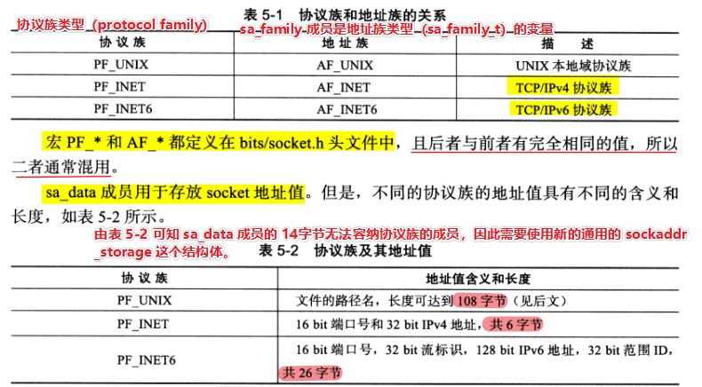
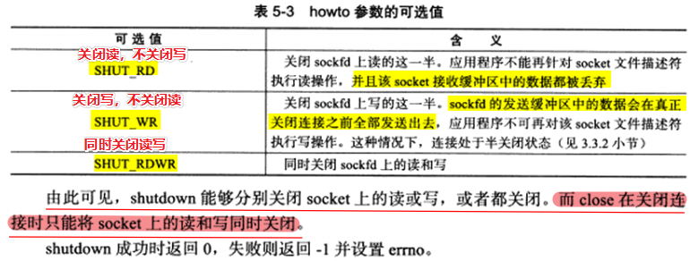
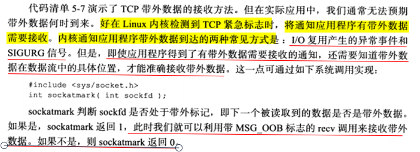
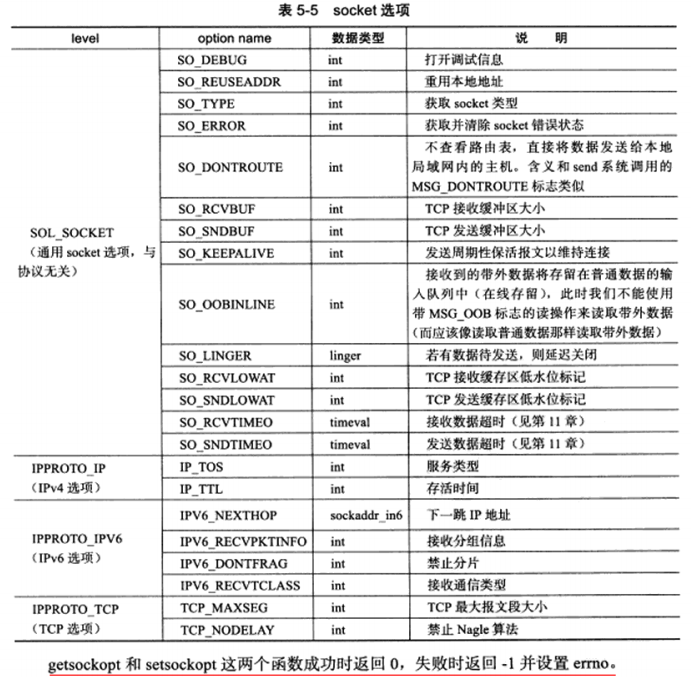

# 5.1 socket 地址 API

**Linux API 分为三种：**

1）**socket 地址 API**：由一个 IP 地址和端口对（**ip，port**），唯一地表示使用 TCP 通信的一端。也被称为 socket 地址。

2）**socket 基础 API**：socket 的主要 API 都定义在 **sys/socket.h** 文件中，包括创建 socket、命名 socket、监听 socket、接受连接、发起连接、读写数据、获取地址信息、检测带外标记，以及读取和设置 socket 选项。

3）**网络信息 API**：用来实现主机名和 IP 地址之间的转换，以及服务名称和端口号之间的转换。这些 API 被定义在 **netdb.h** 文件中。


## 5.1.1 主机字节序和网络字节序

<font color=blue>现代 CPU 的 ACC（累加器）一次都能装载至少 4 字节，字节序分为大端字节序（big endian）和小端字节序（little endian）。</font>

**小端字节序：低位字节在前，高位字节在后。**由于现代 PC（计算机）大多采用小端字节序，因此小端字节序又被称为**主机字节序**。

**大端字节序：高位字节在前，低位字节在后。**由于格式化数据在两台使用不同字节序的主机之间直接传递时，接收端必然错误地解释之。因此大端字节序也被称为**网络字节序，用来给所有接受的主机提供了一个正确解释收到的格式化数据的保证。**

```c++
#include <netinet/in.h>
/*
以下四个函数来完成主机字节序和网络字节序之间的转换：
	如 htonl 表示"host to network long"，即将长整型（32bit）的主机字节序数据转换网络字节序数据。
    如 ntohl 表示"network to host long"，即将长整形（32bit）的网络字节序数据转换主机字节序数据。
*/
/*这四个函数中：长整型函数通常用来转换 ip 地址，短整型函数用来转换端口地址*/
unsigned long int htonl(unsigned long int hostlong);
unsigned short int htons(unsigned short int hostshort);
unsigned long int ntohl(unsigned long int netlong);
unsigned short int ntohs(unsigned short int netshort);
```


## 5.1.2 通用 socket 地址

```c++
#include <bits/socket.h>
/*
socket 网络编程接口中表示 socket 地址的是结构体 sockaddr：
	sa_family 成员是地址族类型（sa_family_t）的变量，地址族类型（sa_family）通常与协议族类型（protocol family，也称为 domain）对应。对应关系可参考表 5-1。
	sa_data 成员用于存放 socket 地址值。但是不同协议族的地址值具有不同的含义和长度，可参考表 5-2。
*/
struct sockaddr
{
    sa_family_t sa_family;
    char sa_data[14];
};

/*
用来解决结构 sockaddr 中成员 sa_data 无法容纳多数协议族的地址值，而使用下面这个新的通用的 socket 地址结构体。
这个结构体不仅提供了足够大的空间用来存放地址值，而且是内存对齐的（这是由于 __ss_align 成员的作用）。
*/
struct sockaddr_storage
{
	sa_family_t sa_family;
    unsigned long int __ss_align;
    char __ss_padding[128-sizeof(__ss_align)];
};
```




## 5.1.3 专用 socket 地址

上一节（5.1.2）介绍了通用 socket 地址，但是这两个通用 socket 地址结构体显然很不好用，比如设置与获取端口号就需要进行繁琐的位操作。**因此 Linux 为各个协议族提供了专门的 socket 地址结构体。**

<font color=alice>注：虽然 Linux 为各个协议族提供了专门的 socket 地址结构体，但是所有的专用 socket 地址（包括上一小节中的 sockaddr_storage 结构体）类型的变量，在实际使用过程中都需要强制类型转换为通用 socket 地址类型 sockaddr 的，因为所有 socket 编程接口使用的地址参数类型都是 sockaddr 的。</font>

```c++
#include <sys/un.h>

/* UNIX 本地域协议族使用以下专用 socket 地址结构体 */
struct sockaddr_un
{
	sa_family_t sin_family;	/* 地址族：AF_UNIX */
    char sun_path[108];		/* 文件路径名 */
};


/* sockaddr_in 是专门用于 IPv4 地址的结构体*/
struct sockaddr_in
{
    sa_famliy_t sin_family;		/* 地址族：AF_INET */
    u_int16_t sin_port;			/* 端口号，要用网络字节序表示（大端方式） */
   	struct in_addr sin_addr;	/* IPv4结构体地址 */
};
struct in_addr
{
   u_int32_t s_addr;/* IPv4 地址，要用网络字节序（大端方式）表示 */ 
};


/* sockaddr_in6 是专门用于 IPv6 地址的结构体 */
struct sockaddr_in6
{
	sa_famliy_t sin6_family;	/* 地址族：AF_INET 6 */
    u_int16_t sin6_port;		/* 端口号，要用网络字节序表示（大端方式） */
    u_int32_t sin6_flowinfo;	/* 流消息，应设置为 0 */
    struct in6_addr sin6_addr;	/* IPv6结构体地址 */
    u_int32_t sin6_scope_id;	/* scope ID，尚处于实验阶段 */
};
struct in6_addr
{
    unsigned char sa_addr[16];/* IPv6 地址，要用网络字节序（大端方式）来表示 */
};
```


## 5.1.4 IP 地址转换函数

**记录日志时，需要把整数表示的 IP 地址转换为可读的字符串，以下三个函数可用于将点分十进制字符串表示的 IPv4 地址和用网络字节序（大端方式）整数表示的 IPv4 地址之间进行相互转换。**

```C++
#include <arpa/inet.h>

/* 将点分十进制字符串表示的 IPv4 地址转换为用网络字节序整数（大端方式）表示的 IPv4 地址，失败则返回 INADDR_NONE。 */
int_addr_t inet_addr(const char* strptr);

/* 也是将点分十进制字符串表示的 IPv4 地址转换为用网络字节序整数（大端方式）表示的 IPv4 地址，但是是将转换结果存储在参数 inp 指向的地址结构体中。 */
int inet_aton(const char* cp, struct in_addr* inp);

/* 将网络字节序（大端方式）整数表示的IPv4地址转换为用点分十进制字符串表示的IPv4地址。由于该函数内部用一个静态变量来存储转换结果，函数的返回值指向该静态内存，因此 inet_ntoa 是不可重入。 */
char* inet_ntoa(struct in_addr in);
```


# 5.2 创建socket
UNIX/Linux 的一个哲学是：一切东西皆文件。

```c++
/*
	domain 参数告诉系统使用哪个底层协议族。对于 TCP/IP 协议族而言，该参数应设置为 PF_INET（用于 IPv4）或PF_INET6（用于 IPv6）；对于 UNIX 本地协议族而言，该参数应该设置为 PF_UNIX。
	type 参数指定服务类型。对于 TCP/IP 协议族而言，其值取 SOCK_STREAM 并表示传输层使用 TCP 协议，取 SOCK_DGRAM 表示传输层使用 UDP 协议。
	protocol 参数是在前两个参数构成的协议集合下，再选择一个具体的协议。一般设置为 0，表示使用默认协议。
	socket 系统调用成功时返回一个 socket 文件描述符，失败则返回 -1 并设置 errno。
*/
int socket(int domain, int type, int protocol);
```


# 5.3 命名 socket

<font color=blue>将一个 socket 与 socket 地址绑定称为给**socket命名**。</font>

<font color=alice>在服务器程序中，通常需要命名 socket，因为只有命名了 socket 后客户端才知道如何连接它。客户端则通常不需要命名 socket，而是采用**匿名方式**，即使操作系统自动分配的 socket 地址。</font>

```c++
/*
命名 socket 的系统调用是使用 bind() 函数：
	bind 将 my_addr 所指的 socket 地址分配未命名的 sockfd 文件描述符，addrlen 参数指出该 socket 地址的长度。
	
bind 成功时返回 0，失败则返回 -1 并设置 errno。其中两种常见的 errno 是 EACCES 和 EADDRINUSE，其含义分别如下：
	EACCES：被绑定的地址是受保护的地址，仅超级用户能够访问。比如普通用户将 socket 绑定到知名服务端口（端口号为0~1023）上时，bind 将返回 EACCES 错误。
	EADDRINUSE：被绑定的地址正在使用中。比如将 socket 绑定到一个处于 TIME_WAIT 状态的 socket 地址。
*/
int bind(int sockfd, const struct sockaddr* my_addr, socklen_t addrlen);
```


# 5.4 监听 socket

**socket 被命名 bind 之后，还不能马上接受客户连接。需要使用一个监听队列来存放待处理的客户连接：**

```C++
/*
	sockfd 参数表示指定被监听的 socket；
	backlog 参数提示内核监听队列的最大长度。若监听队列的长度如果超过 backlog，那么服务器将不受理新的客户连接，客户端也将收到 ECONNREFUSED 错误信息。
	listen 成功时返回 0，失败则返回 01 并设置 errno。
*/
int listen(int sockfd, int backlog);
```


# 5.5 接受连接

**监听 socket**：是指执行过 listen 调用并处于 LISTEN 状态的 socket。

**连接 socket**：是指所有处于 ESTABLISHED 状态的 socket。

```c++
/*
	sockfd 参数是执行过 listen 系统调用的监听 socket。
	addr 参数用来获取被接受连接的远端 socket 地址，该 socket 地址的长度由 addrlen 参数指出。
	accept 成功时返回一个新的连接 socket，该 socket 唯一地标识了被接受的这个连接，服务器可通过该 socket 来与被接受连接的客户端进行通信。accept 失败时返回 -1 并设置 errno。
*/
#include <sys/types.h>
#include <sys/socket.h>
int accept(int sockfd, struct sockaddr* addr, socklen_t *addrlen);
```


# 5.6 发起连接

**服务器可以通过 listen 调用来被动接受连接，那么客户端可以通过 connect 来主动与服务器建立连接。**

```c++
#include <sys/types.h>
#include <sys/socket.h>
/*
	sockfd 参数是由 socket 系统调用返回的一个 socket。serv_addr 参数是服务器监听的 socket 地址。addrlen 参数则是指定服务器监听的地址的长度。
	connect 成功是返回 0，并且一旦连接成功，sockfd 就唯一地标识了这个连接，客户端就可以通过读写 sockfd 来与服务器进行通信了。
	connect 失败则返回 -1 并设置 errno。其中常见的两种 errno 是 ECONNREFUSED（表示目标端口不存在，连接被拒绝）和 ETIMEDOUT（连接超时）。
*/
int connect(int sockfd, const struct sockaddr* serv_addr, socklen_t addrlen);
```


# 5.7 关闭连接

```c++
#include <unistd.h>
/*
	关闭一个连接实际上就是关闭该连接对应的 socket。
	fd 参数表示是带关闭的 socket，close 系统调用并非总是立即关闭一个连接，而是将 fd 的引用计数减 1（类比操作系统中文件的硬链接中的引用计数）。
	在多进程程序中，一次 fork 系统调用默认将父进程中打开的 socket 的引用计数加 1，因此只有在父进程和子进程中都对该 socket 执行 close 调用才能将连接关闭。
*/
int close(int fd);
```


```c++
#include <sys/socket.h>
/*
使用 shutdown 能将 socket 连接立即终止，相对于 close 来说 shutdown 是专门为网络编程设计的。
参数 sockfd 是带关闭的 socket，参数 howto决定了 shutdown 的行为，可选择下表中的某个值。
*/
int shutdown(int sockfd, int howto);
```




# 5.8 数据读写

## 5.8.1 TCP 数据读写

**flags 参数只对 send 和 recv 的当前调用生效。**

```c++
#include <sys/types.h>
#include <sys/socket.h>
/* 
	recv 读取 sockfd 上的数据，buf 指定读缓冲区的位置，len 指定读缓冲区的大小，flag 参数通常设置为 0，具体参数函数见下表 5-4。
	recv 函数成功时返回实际读取到的数据长度，它可能小于 len，因此有时候需要多次调用 recv 才能读取到完整的数据。recv 返回 0 时，表示通信对方以及关闭连接了。recv 出错时返回 -1 并设置 errno。
*/
ssize_t recv(int sockfd, void *buf, size_t len, int flags);

/*
	send 往 sockfd 上写入数据，buf 和 len 参数分别指定了写缓冲区的位置和大小。send 成功时返回实际写入数据的数据长度，失败则返回 -1 并设置 errno。
*/
ssize_t send(int sockfd, const void *buf, size_t len, int flags);
```


## 5.8.2 UDP 数据读写

下面这两个用于 UDP 读写的系统调用也可以用于**用于面向连接的 socket 数据的读写。由于在面向连接中我们已经知道双方的 socket 地址，因此只用将后面两个参数设置为 NULL 就可用面向连接了。**

```c++
#include <sys/types.h>
#include <sys/socket.h>
/*
由于 UDP 通信没有连接的概念，因此每次在读取数据的时候都需要获取发送端的 socket 地址，即参数 src_addr 所值的内容和 addrlen 参数指定该地址的长度。
recvfrom 读取 sockfd 上的数据，buf 和 len 参数分别指定读缓冲区的位置和大小。
*/
ssize_t recvfrom(int sockfd, void* buf, size_t len, int flags, struct sockaddr* src_addr, socklen_t* addrlen);

/*
sendto 往 sockfd 上写入数据，buf 和 len 参数分别指定写缓冲区的位置和大小。dest_addr 参数指定接手端的 socket 地址，addrlen 参数则指定该地址的长度。
*/
ssize_t sendto(int sockfd, const void* buf, size_t len, int flags, const struct sockaddr* dest_addr, socklen_t* addrlen);
```


## 5.8.3 通用数据读写函数

```c++
#include <sys/socket.h>
/* sockfd 参数用来指定被操作的目标 socket，msg 参数是 msghdr 结构体类型的指针，flags 参数与表 5-4 中的一致。 */
ssize_t recvmsg(int sockfd, struct msghdr* msg, int flags);
ssize_t sendmsg(int sockfd, struct msghdr* msg, int flags);

struct msghdr
{
    /* socket 地址：用来指定通信对方的 socket 地址，对于面向连接的 TCP 协议，该成员没有意义，必须被设置为 NULL。 */
    void* msg_name;
    /* 指定 msg_name 所值 socket 地址的长度 */
    socklen_t msg_namelen;
    /* 该结构体定义见下面 */
    struct ioves* msg_iov;
    /* 说明分散内存块的数量 */
    int msg_iovlen;
    /* 用于辅组数据的传送，指定辅组数据的起始位置 */
    void* msg_control;
    /* 也是用于辅组数据的传送，用来说明辅组数组的大小 */
    socklen_t msg_controllen;
    /* 复制上面函数中的 flags 参数，并在调用过程中进行更新 */
    int msg_flags;
};

/* 
	iovec 结构体封装了一块内存的起始位置和长度，通过上面 msghdr 结构体中的变量 msg_iovlen 来指定这样的内存块有多少个。
	对于 recvmsg 而言，数据将被读取并存储在 msg_iovlen 个分散的内存块中，这些内存块的位置和长度由 msg_ivo 指向的结构体决定，这也被称为集中读。
	对于 sendmsg 而言，msg_iovlen 个分散的内存块中的数据将被一起发送，这也被称为集中写。
*/
struct iovec
{
	void *iov_base; /* 内存的起始地址 */
    size_t iov_len;	/* 这块内存的长度 */
};
```


# 5.9 带外标记




# 5.10 地址信息函数

```c++
#include <sys/socket.h>
/* 用来获得 sockfd 对应的本端 socket 地址，并将其存储在 address 参数指定的内存中，该 socket 地址的长度则存储在 address_len 参数指向的变量中。
注意当实际的 socket 地址的长度 address 所指内存区的大小时，则该 socket 地址将会被截断。函数成功返回 0，失败返回 -1 并设置 errno。
*/
int getsockname(int sockdf, struck sockaddr* addresss, socklen_t* address_len);
/* 用来获得 sockfd 对应的远端 socket 地址，其参数及返回值的含义与 getsocketname 的参数及返回值相同。 */
int getpeername(int sockfd, struct sockaddr* address, socklen_t* address_len);
```


# 5.11 socket 选项

```c++
#include <sys/socket.h>
int getsockopt(int sockfd, int level, int option_name, void* option_value, socklen_t* restrick option_len);
int setsockopt(int sockfd, int level, int option_name, const void* option_value, socklen_t option_len);
```



