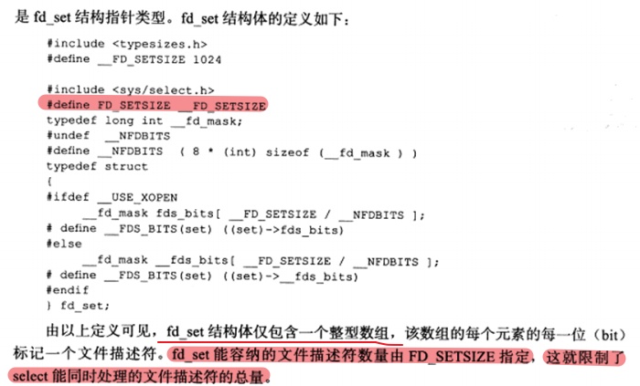
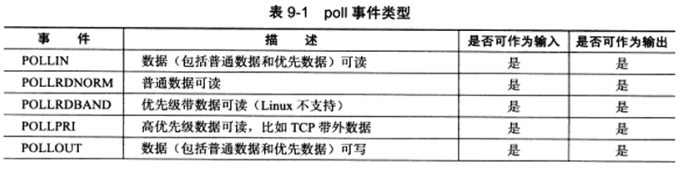
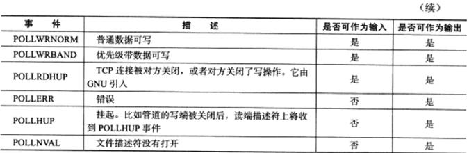
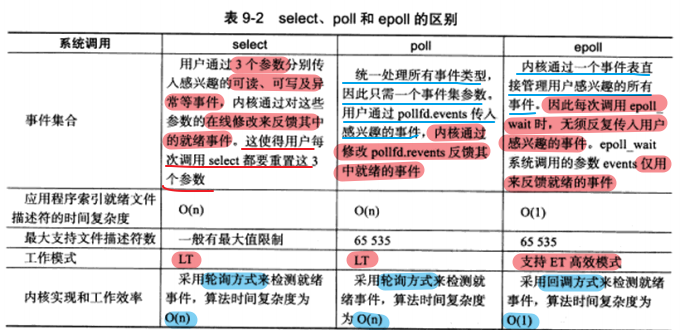

IO 复用使得程序能同时监听多个文件描述符。通常，网络程序在以下几个情况中需要使用 IO 复用技术：

* 1）客户端程序要同时处理多个 socket。
* 2）客户端程序要同时处理用户输入和网络连接。
* 3）TCP 服务器要同时处理监听 socket 和连接 socket。
* 4）服务器要同时处理 TCP 请求和 UDP 请求。
* 5）服务器要同时监听多个端口，或者处理多种服务。

**虽然 IO 复用能同时监听多个文件描述符，但是它本身是阻塞的。**并且当多个文件描述符同时就绪时，如果不采用额外的措施，程序就只能按顺序依次处理其中的每一个文件描述符，这使得服务器程序看起来像是串行工作的。如果要实现并发，只能使用多进程或者多线程等编程手段。

# 9.1 select 系统调用

select 系统调用的用途是：在一段指定时间内，监听用户感兴趣的文件描述符上的可读、可写和异常事件。

## 9.1.1 select API

```c++
#include <sys/select.h>
/* nfds 参数用来指定被监听到的文件描述符的总数，通常被设置为 select 监听的所有文件描述符中的最大值加1，因为文件描述符是从 0 开始计数的。
readfds、writefds、exceptfds 参数分别指定可读、可写和异常等事件对应的文件描述符集合。应用程序调用 select 函数时，通过这 3 哥参数传入自己感兴趣的文件描述符。select 调用返回时，内核将修改它们来通知应用程序哪些文件描述符已经准备就绪。
timeout 参数用来设置 select 函数的超时时间。是一个 timeval 结构类型的指针，采用指针的目的是内核将修改它来告诉应用程序 select 等待了多久。但是这个时间不是准的，因为调用失败后的 timeout 值是不确定的。*/
/* select 成功时返回就绪（可读、可写和异常）文件描述符的总数。如果在超时时间内没有任何文件描述符就绪，select 将返回 0，失败就返回 -1 并设置 errno。如果在 select 等待期间，程序收到信号，则 select 立即返回 -1，并设置 errno 为 EINTR。*/
int select(int ndfs, fd_set* readfds, fd_set* writefds, fd_set* exceptfds, struct timeval* timeout);

struct timeval
{
	long tv_sec;	// 秒数
    long tv_usec;	// 微秒数
};
```




## 9.1.2 文件描述符就绪条件


## 9.1.3 处理带外数据

**socket 接收普通数据，它处于可读状态；socket 接收带外数据，它处于异常状态。**


# 9.2 poll 系统调用

poll 系统调用和 select 类似，也是**在指定时间内轮询一定数量的文件描述符，以测试其中是否有就绪者。**

<font color=blue>通常情况下，应用程序需要根据 recv 调用的返回值来区分 socket 上接收到的是有效数据还是对方关闭连接的请求，并做出相应的处理。</font>

```c++
#include <poll.h>

/* fds 用来指定文件描述符上发生的可读、可写、异常等事件；nfds 参数用来指定被监听事件集合 fds 的大小；timeout 参数指定 poll 的超时，单位是毫秒。当 timeout=-1 时，poll 掉将永远被阻塞，直到某个事件发生；当 timeout 为 0 时，poll 调用将立即返回。 */

/* poll 成功时返回就绪（可读、可写和异常）文件描述符的总数。如果在超时时间内没有任何文件描述符就绪，poll 将返回 0，失败就返回 -1 并设置 errno。如果在 poll 等待期间，程序收到信号，则 poll 立即返回 -1，并设置 errno 为 EINTR。*/
int poll(struct pollfd* fds, nfds_t nfds, int timeout);

/* fd 成员用来指定文件描述符；events 成员用来告诉 poll 监听 fd 上的哪些事件，由一系列事件按位进行或；revents 成员由内核修改，用来通知应用程序 fd 上实际发生了的事件数。 */
struct pollfd
{
	int fd;			// 文件描述符
    short events;	// 注册的事件
    short revents;	// 事件发生的事件，由内核填充
};
```

**poll 支持的事件类型如下：**






# 9.3 epool 系统系统调用

## 9.3.1 内核时间表

epoll 是 Linux 特有的 IO 复用函数。

* 1）epoll 是使用一组函数来完成任务，而不是使用单个函数。
* 2）epoll 把用户关心的文件描述符上的事件放在内核里面的一个事件表中，不需要像 select 和 poll 那样每次调用都要重复传入文件描述符集或者事件集。**但是 epoll 需要使用一个额外的文件描述符，来唯一标识内核中的这个事件表。**这个文件描述符由 epoll_create 来创建。

```c++
#include <sys/epoll.h>
/* 参数 size 现在并不起作用，只是给内核一个提示，告诉这个事件表需要多大。
该函数返回的文件描述符将作用其他 epoll 系统调用的第一个参数，以指定要访问的内核事件表。 */
int epoll_create(int size);

/* epoll_ctl 是用来操作 epoll 的内核事件表的：fd 参数用来表示要操作的文件描述符，op 参数则用来指定操作类型，event 参数用来指定事件。 */
int epoll_ctl(int epfd,int op,int fd, struct epoll_event* event);

/* events 成员描述事件类型 */
/* 表示 epoll 事件类型的宏是在 poll 对应的宏前加上"E"，比如 epoll 的数据可读事件是 EPOLLIN，但是 epoll 有两个额外的事件类型--EPOLLET 和 EPOLLONESHOT。 */
struct epoll_event
{
	__uint32_t events;	// epoll 事件
    epoll_data_t data;	// 数据
};

typedef union epoll_data
{
    void* ptr;
    int fd;
    uint32_t u32;
    uint64_t u64;
}epoll_data_t;
```

op 参数的操作类型有如下 3 种：


## 9.3.2 epoll_wait 函数

```c++
#include <sys/epoll.h>
/* 函数功能：表示在一段超时时间内，等待一组文件描述符上的事件。
参数意义：timeout 参数指定 poll 的超时，单位是毫秒。maxevents 参数指定最多监听多少个事件，它必须大于 0。epoll_wait 如果检查到事件，就将所有就绪事件从内核事件表中，也就是 epfd 参数指定的内核事件表复制到它的第二个参数 events 指向的数组中。 */
int epoll_wait(int epfd,struct epoll_event* events, int maxevents, int timeout);
```


## 9.3.3 LT 和 ET 模式

epoll 对文件描述符的操作有两种模式：LT（Level Trigger，电平触发） 和 ET（Edge Trigger，边沿触发） 模式。

* 1）**LT 模式**是默认的工作方式，这种模式下 epoll 相当于是一个效率较高的 poll。当往 epoll 内核事件表中注册一个文件描述符上的 **EPOLLET** 事件时，epoll 将以 ET 模式来操作该文件描述符。**ET 模式是 epoll 的高效工作模式。**
* 2）**LT 模式**是指当 epoll_wait 检查到其上有事件发生，并将此事件通知给应用程序后，**应用程序可以不立即处理该事件**。这样当应用程序下一次调用 epoll_wait 时，epoll_wait 还是会再次向应用程序告知此事件，**直到该事件被处理。**
* 3）**ET 模式**是指当 epoll_wait 检测到其上有事件发生并将此事件通知应用程序后，**应用程序必须立即处理该事件**。因此，ET 模式很大程度上降低了同一个 epoll 事件被重复触发的次数，因此效率要比 LT 模式高。

## 9.3.4 EPOLLONESHOT 事件

**使用 epoll 的 EPOLLONESHOT 事件来让 socket 连接在任一时刻都只被一个线程处理。**

<font color=blue>对于注册了 EPOLLONESHOT 事件的文件描述符，OS 最多触发其上注册的一个可读、可写或者异常事件，且触发一次，除非使用 epoll_ctl 函数重置该文件描述符上注册的 EPOLLONESHOT 事件。</font>


# 9.4 三组 IO 复用函数的比较

<font color=alice>select、poll 和 epoll 这三组 IO 复用系统调用都能同时监听多个文件描述符，它们将等待由 timeout 参数指定的超时时间，直到一个或者多个文件描述符上有事件发生时返回，返回值是就绪的文件描述符的数量。返回 0 表示没有事件发生。</font>

**三者的区别如下：**


