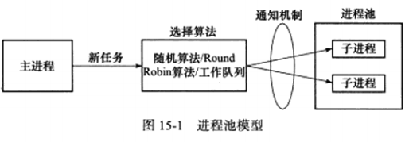

# 15.1 进程池和线程池概述

进程池和线程池相似，进程池是由服务器预先创建的一组子进程，这些子进程的数据在3-10个之间。线程池中的线程数量应该和CPU数量差不多。

进程池中的所有子进程都运行着相同的代码，并具有相同的属性。因为进程池在服务启动之初就创建好了，所以每个子进程都没有打开不必要的文件描述符，也不会错误地使用大块的堆内存。

当有新的任务到来时，主进程将通过某种方式选择进程池中的某一个子进程来为之服务。相比于动态创建子进程，选择一个已经存在的子进程的代价要小得多。至于主进程选择哪个子进程来为新任务服务，有以下两种方式：

* 1）**主进程使用某种算法来主动选择子进程。**最简单、最常用的算法是随机算法和 Round Robin（轮流算法），但更优秀、更智能的算法将使任务在各个工作进程中更均匀地分配，从而减轻服务器的整体压力。

* 2）**主进程和所有子进程通过一个共享的工作队列来同步，子进程都睡眠在该工作队列上。**当有新的任务到来时，主进程将任务添加到工作队列中。这将唤醒正在等待任务的子进程，不过只有一个子进程可以从工作队列中取出任务并执行之，而其他子进程将继续睡眠在工作队列上。

当选择好子进程后，主进程还需要使用某种通知机制来告诉目标子进程有新任务需要处理，并传递必要的数据。最简单的方法是，**在父进程和子进程之间预先建立好一条管道，然后通过该管道来实现所有的进程间通信（要预先定义好一套协议来规范管道的使用）**。在父线程和子线程之间传递数据就要简单的多，因为我们**可以把这些数据定义为全局的，那么它们本身就是被所有线程共享的。**

综上，进程池的一般模型描绘为下图形式：

# 15.2 处理多客户

在使用进程池处理多客户任务时，首先要考虑的一个问题是：监听 socket 和连接 socket是否都由主进程来统一管理。

* 1）半同步/半反应堆模式**由主进程统一管理这两种 socket 的**。这种情况下，主进程接受新的连接以得到连接 socket，然后它需要将该 socket 传递给子进程。
* 2）高效的半同步/半异步模式和领导者/追随者模式，则是**主进程管理监听 socket，子进程管理属于自己的连接 socket**。这种情况下的灵活性更大，子进程可以调用 accept 来接受新的连接，这样父进程就无须向子进程传递 socket 了，只需通知子进程自己检测到 socket 就行。

在设计进程池时还要考虑如下：一个客户连接上的所有任务是否始终由一个子进程来处理。

* 1）客户任务是无状态的，可以使用不通的子进程来为该客户的不同请求来服务。
* 2）客户任务是存在上下文关系的，则最好使用同一个子进程来为之服务，否则实现起来较复杂，因为这样我们不得不在各个子进程之间传递上下文数据。

# 15.3 半同步/半异步进程池实现

详情见代码 15_1.cpp。