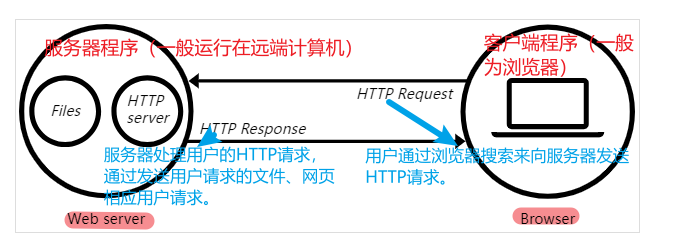

# 1. 什么是Web Server（网络服务器）

一个 Web Server 就是一个服务器软件（程序），或者运行这个服务器软件的硬件（计算机）。其主要功能是通过 HTTP 协议与客户端（通常是`浏览器 Browser`）进行通信，来接收、存储、处理来自客户端的 HTTP 请求，并对其请求做出 HTTP 响应，返回给客户端其求情的内容（文件、网页等）或者返回一个 Error 信息。

# 2. 用户如何与 Web Server 服务器进行通信的？

通常用户通过 Web 浏览器与相应的服务器进行通信的。

* 1）在浏览器输入“域名”或者“IP地址:端口号”，浏览器首先将域名解析成相应的 IP 地址或者直接根据 IP 地址向对应的 Web 服务器发送一个 HTTP 请求。
* 2）**这一过程具体为：浏览器利用 IP 地址与服务器三次握手，建立 TCP 连接。浏览器会以一个随机端口向服务器端的 Web 程序的 80 端口发起 TCP 连接。**
* 3）建立 TCP 连接后，浏览器向主机发送一个 HTTP 请求报文。
* 4）服务器响应 HTTP 请求，返回响应数据。
* 5）浏览器**解析相应内容，进行渲染**，呈现给用户。