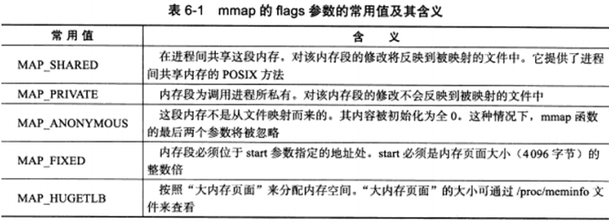
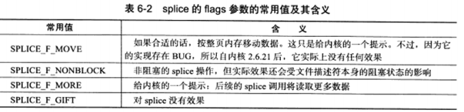
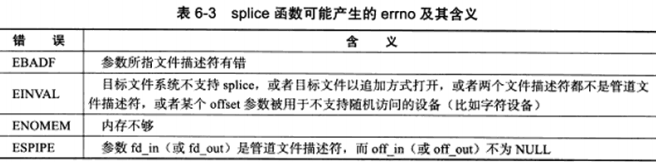
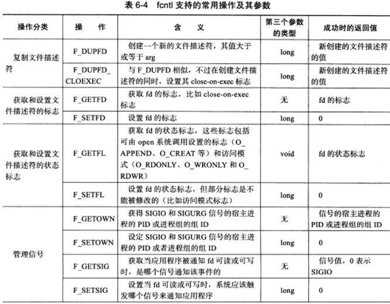
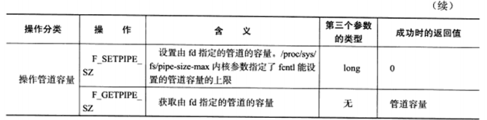

本章主要介绍与网络编程相关的 IO 函数，这些函数大致分为三类：

* **用于创建文件描述符的函数**，包括 `pipe、dup/dup2` 函数。
* **用于读写数据的函数**，包括 `readv/writev、sendfile、mmap/munmap、splice 和 tee `函数。
* **用于控制 IO 行为和属性的函数**，包括 `fcntl` 函数。


# 6.1 pipe 函数

pipe 函数主要是用于管道通信的，可以想到 OS 中的 pipe 管道。

```c++
#include <unistd.h>
/* 
	pipe函数的参数是一个包括两个 int 行整数的数组指针。
	通过 pipe 函数创建的两个文件描述符 fd[0] 和 fd[1] 分别构成管道的两端，往 fd[1] 写入的数据可以从 fd[0] 读出。并且 fd[0] 只能用于从管道读出数据，fd[1] 只能用于往管道写入数据，二者不能反过来使用。
*/
int pipe(int fd[2]);
```


# 6.2 dup 函数和 dup2 函数

**使用复制文件描述符的 dup 或 dup2 函数**<font color=alice>可以将标准输入重定向到一个文件，或者把标准输出重定向到一个网络连接。</font>

```c++
#include <unistd.h>
/* dup 函数创建一个新的文件描述符，该新文件描述符和原有文件描述符 file_descriptor 指向相同的文件、管道或者网络连接。并且 dup 返回的文件描述符总是取系统当前可用的最小整数值。 */
int dup(int file_descriptor);
/* dup2 与 dup 类似，返回第一个大于等于 file_descriptor_two 的整数值。dup 和 dup2 调用失败时函数返回-1并设置 errno。 */
int dup2(int file_descriptor_one, int file_descriptor_two);
```


# 6.3 readv 函数和 writev 函数

**分散读**：readv() 将数据从文件描述符读到分散的内存块中。

**集中写**：writev() 将多块分散的内存数据一并写入文件描述符中。

```c++
#include <sys/uio.h>
/* fd 表示被操作的目标文件描述符；vector 参数的类型使 iovec 结构数组，该结构体描述一块内存区；count 参数是 vector 数组的长度，即有多少块内存数据需要从 fd 读出或写到 fd。 */
/* 这两个函数相当于是简化版的 recvmsg 和 sendmsg 函数了。 */
ssize_t readv(int fd, const struct iovec* vector, int count);
ssize_t writev(int fd, const struct iovec* vector, int count);
```


# 6.4 sendfile 函数

```c++
#include <sys/sendfile.h>
/* sendfile 函数再两个文件描述符之间直接传递数据，从而避免了内核缓冲区和用户缓冲区之间的数据拷贝、效率很高，因此也被称为零拷贝。 */
/* in_fd 表示待读出内容的文件描述符，out_fd 表示待写入内容的文件描述符。offset 参数指定从读入文件流的哪个位置开始读，如果为空，则使用读入文件流默认的起始位置。count 参数指定在文件描述符 in_fd 和 out_fd 之间传递的字节数。 */
/* sendflie 成功时返回传输的字节数，失败则返回 -1 并设置 errno。 */
/* in_fd 必须是一个支持类似 mmap 函数的文件描述符，即它必须指向真实的问就按，不能是 socket 和管道；而 out_fd 则必须是一个 socket。 */
ssize_t sendfile(int out_fd, int in_fd, off_t* offset, size_t count);
```


# 6.5 mmap 函数和 munmap 函数

**mmap 函数用于申请一段内存空间**，将这段内存作为进程间通信的共享内存，也可以将文件直接映射到其中。

**munmap 函数用来释放 mmap 创建的这段内存空间。**

```c++
#include <sys/mman.h>
/* 
	start 参数允许用户使用特定的地址作为这段内存的起始地址。如果它被设置为 NULL，则系统自动分配一个地址。
	length 参数指定内存短的长度。
	port 参数用来设置内存段的访问权限，其值可以由下面几个字段进行或操作。
	flags 参数控制内存段内容被修改后程序的行为。它可以被设置为表 6-1 中的某些值的按位或，其中 MAP_SHARED 和 MAP_PRIVATE 是互斥的，不能同时指定。
	fd 参数是被映射文件对应的文件描述符。它一般通过 open系统调用获得。
	offset 参数设置为开始映射的位置。
*/

// mmap 函数成功时返回指向目标内存区域的指针，失败则返回 MAP_FAILED 并设置 errno。
void *mmap(void *start, size_t length, int port, int flags, int fd, off_t offset);

// munmap 函数成功时返回 0，失败时返回 -1 并设置 errno。
int munmap(void* start, size_t length);
```


<center>port的参数值</center>





# 6.6 splice 函数

```c++
#include <fcntl.h>
ssize_t splice(int fd_in, loff_t *off_in, int fd_out, loff_t* off_out, size_t len, unsigned int flags);
```





# 6.7 tee 函数

```c++
#include <fcntl.h>
/* tee 函数在两个管道文件描述符之间复制数据，也是零拷贝操作。 */
/* 该函数的参数与 splice 相同，但是要求 fd_in 和 fd_out 必须都是管道文件描述符。tee 函数成功时返回两个文件描述符之间复制的数据数量（字节数），返回 0 表示没有复制任何数据。tee函数失败返回 -1 并设置errno。 */
ssize_t tee(int fd_in, int fd_out, size_t len, unsigned int flags);
```


# 6.8 fcntl 函数

```c++
#include <fcntl.h>
/* fd 参数是被操作的文件描述符，cmd 参数指定执行何种类型的操作。 */
int fcntl(int fd, int cmd, ...);
```

根据操作类型的不同，第三个参数可被指定不同的类型：



