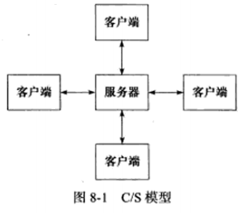
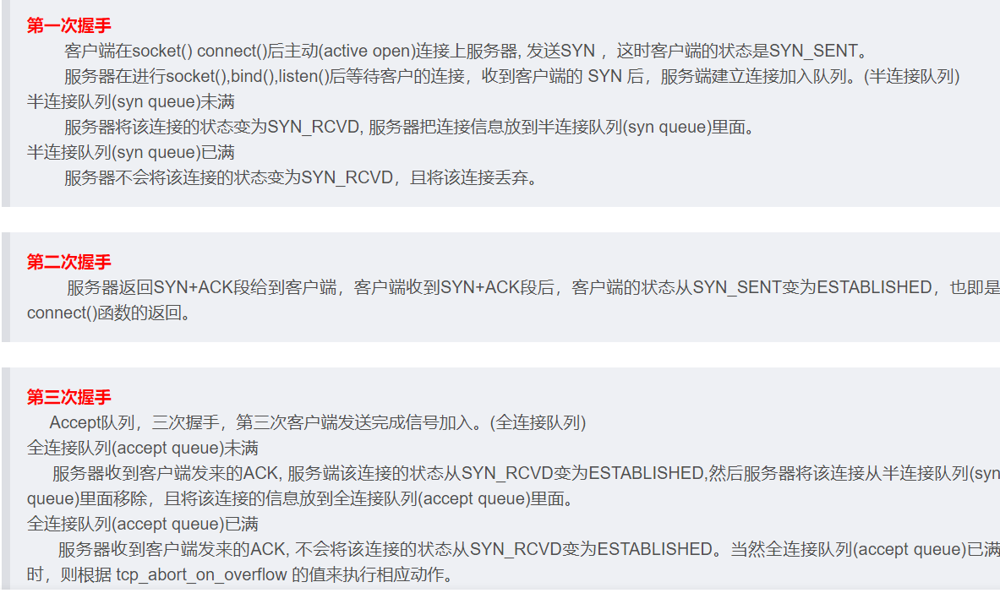
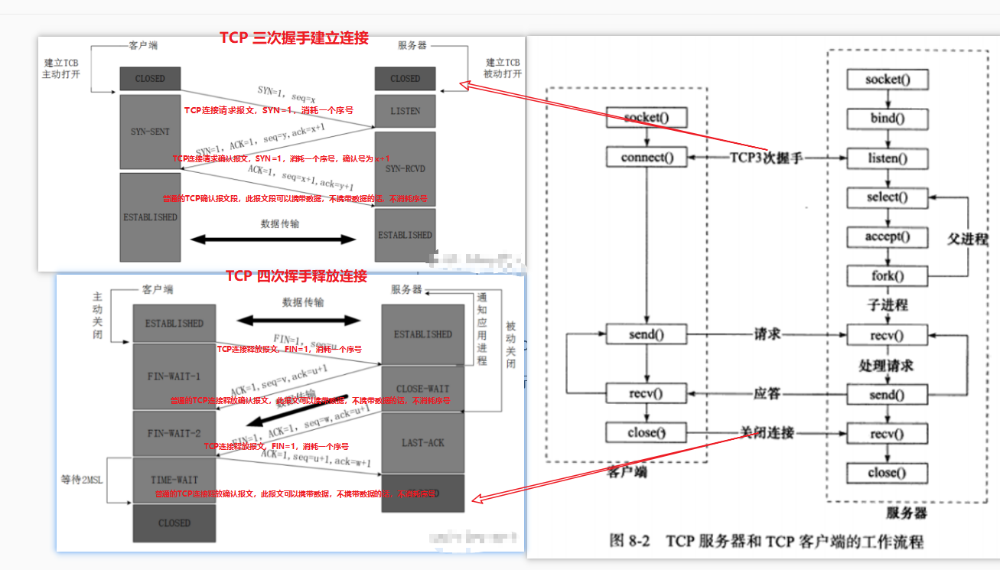
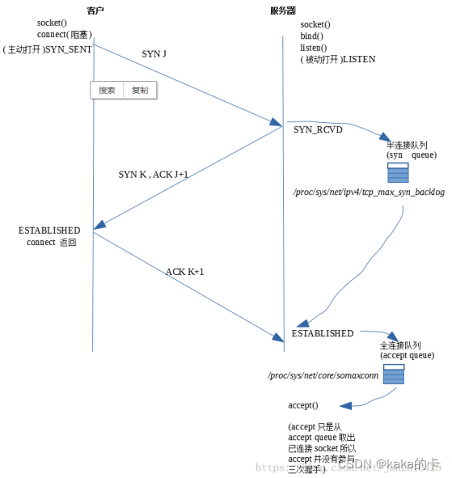
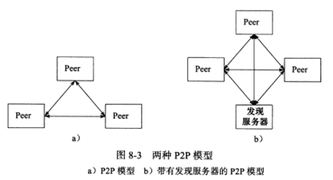
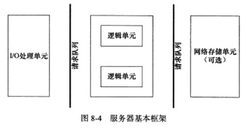
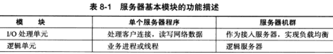
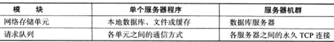

本章内容为面试考察重点，之后根据面经再来复盘本章内容。。。

服务器主要分为三个模块：

* **IO 处理单元**：介绍有四种 IO 模型和两种高效事件处理模式。
* **逻辑单元**：介绍两种高校并发模式，以及高效的逻辑处理方式--有限状态机。
* **存储单元**：与网络编程本身无关，本书不进行讨论。

# 8.1 服务器模型

## 8.1.1 C/S 模型

C/S 模型：所有客户端都通过访问服务器来获取所需的资源。

> 

**TCP 下的服务器与客户端的工作流程：**

参考：[TCP三次握手和四次挥手详解](https://blog.csdn.net/kakaka666/article/details/126355782)

> 
>
> 

## 8.1.2 P2P 模型

**P2P模型的优点**：使得每台机器在消耗服务的同时，也能给其他人提供服务，能够使资源充分、自由地共享。

**P2P模型的缺点**：主机之间很难相互发现。因此在实际使用的 P2P 模型通常带有一个专门的发现服务器，这个发现服务器通常还提供查找服务（甚至还可以提供内容服务），使得每个客户都能尽快地找到自己需要的资源。

**从编程角度来说：P2P模型可以看出C/S模型的扩展，每台主机即是客户端，又是服务器。**

# 8.2 服务器编程框架

**服务器基本框架图如下所示：**

**服务器基本模块的功能描述：**

**IO 处理单元是服务器管理客户连接的模块。**

**一个逻辑单元通常是一个进程或一个线程。**

**网络存储单元可以是数据库、缓存和文件，甚至是一台独立的服务器。**

**请求队列是各单元之间通信方式的抽象。**

# 8.3 IO模型

# 8.4 两种高效的事件处理方式

## 8.4.1 Reactor 模式

## 8.4.2 Proactor 模式

## 8.4.3 模拟 Proactor 模式

# 8.5 两种高效的并发模式

## 8.5.1 半同步/半异步模式

## 8.5.2 领导者/追随者模式

# 8.6 有限状态机

todo

# 8.7 提高服务器性能的其他建议

池、数据复制、上下文切换和锁。