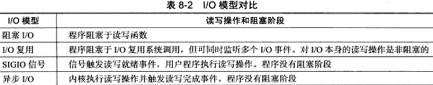
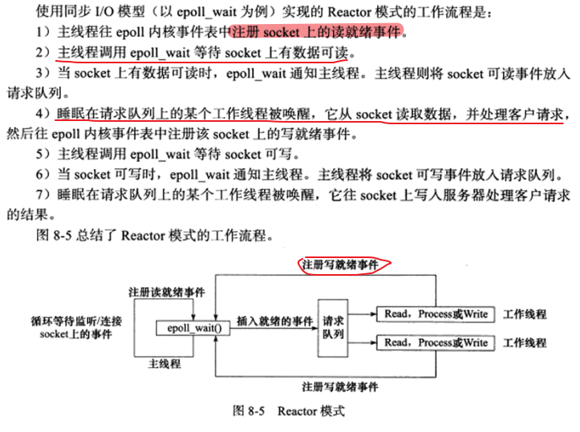
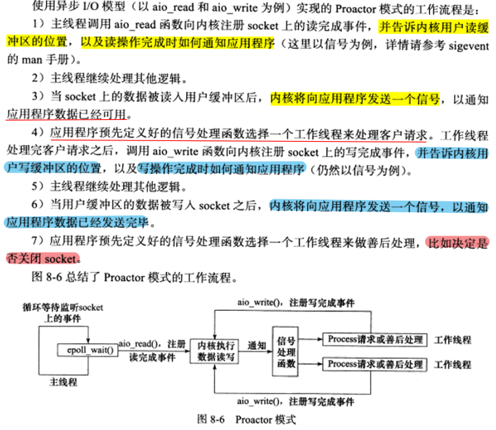
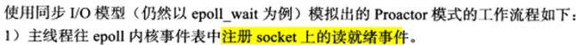
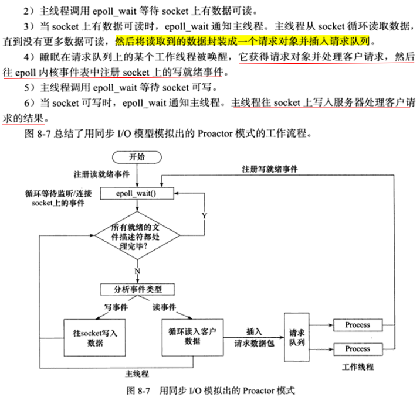
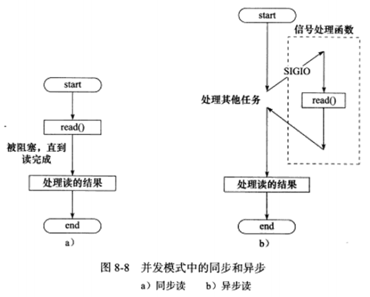
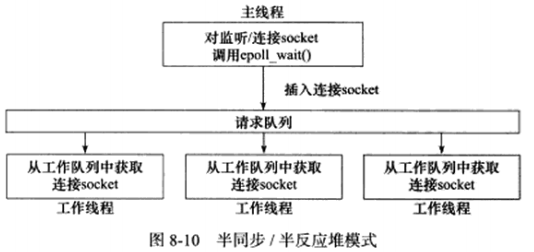
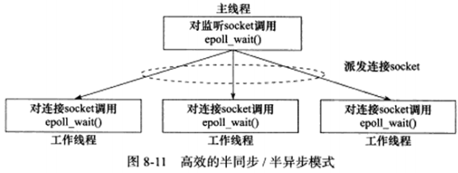

本章内容为面试考察重点，之后根据面经再来复盘本章内容。。。

服务器主要分为三个模块：

* **IO 处理单元**：介绍有四种 IO 模型和两种高效事件处理模式。
* **逻辑单元**：介绍两种高校并发模式，以及高效的逻辑处理方式--有限状态机。
* **存储单元**：与网络编程本身无关，本书不进行讨论。

# 8.1 服务器模型

## 8.1.1 C/S 模型

C/S 模型：所有客户端都通过访问服务器来获取所需的资源。

> 

**TCP 下的服务器与客户端的工作流程：**

参考：[TCP三次握手和四次挥手详解](https://blog.csdn.net/kakaka666/article/details/126355782)

> 
>
> 

## 8.1.2 P2P 模型

**P2P模型的优点**：使得每台机器在消耗服务的同时，也能给其他人提供服务，能够使资源充分、自由地共享。

**P2P模型的缺点**：主机之间很难相互发现。因此在实际使用的 P2P 模型通常带有一个专门的发现服务器，这个发现服务器通常还提供查找服务（甚至还可以提供内容服务），使得每个客户都能尽快地找到自己需要的资源。

**从编程角度来说：P2P模型可以看出C/S模型的扩展，每台主机即是客户端，又是服务器。**

# 8.2 服务器编程框架

**服务器基本框架图如下所示：**

**服务器基本模块的功能描述：**

* **IO 处理单元是服务器管理客户连接的模块**。用来等待并接受新的客户连接，接受客户数据，将服务器响应数据返回给客户端。

* **一个逻辑单元通常是一个进程或一个线程**。用来分析并处理客户数据，然后将结果传递给 IO 处理单元或者直接发送给客户端。

* **网络存储单元可以是数据库、缓存和文件，甚至是一台独立的服务器**。网络存储单元不是必须存在，比如 ssh、telnet 等登陆服务就不要这个单元。

* **请求队列是各单元之间通信方式的抽象**。IO 处理单元接收到客户请求，是需要以某种方式通知一个逻辑单元来处理该请求。多个逻辑单元同时访问一个存储单元，也要使用某种机制来协调处理竞态条件。

# 8.3 IO模型

阻塞和非阻塞的概念能应用于所有的文件描述符，包括 socket，称**阻塞的文件描述符为阻塞I/O，非阻塞的文件描述符为非阻塞I/O。**

**阻塞I/O**：当用户程序执行 read ，线程会被阻塞，一直等到内核数据准备好，并把数据从内核缓冲区拷贝到应用程序的缓冲区中，当拷贝过程完成，read 才会返回。注意，**阻塞等待的是「内核数据准备好」和「数据从内核态拷贝到用户态」这两个过程**。socket 基础 API 中，阻塞式的系统调用有 accept、send、recv 和 connect（connect：需要阻塞等待三次握手的完成。accept：需要等待可用的已完成的连接，如果已完成连接队列为空，则被阻塞）。

**非阻塞I/O**：非阻塞 IO 的系统调用总是立即返回的，而不管事件是否已经发生。如果事件没有立即发生，这些系统调用返回 -1，与出错情况一样。因此我们必须根据 errno 来区分这两种情况。**显然只有在事件已经发生的情况下，操作非阻塞 IO  才能提高程序的效率。因此，非阻塞 IO 通常要和其他 IO 通知机制一起使用，比如 IO 复用和 SIGIO 信号。SIGIO 信号也能用来报告 IO 事件。** 

**I/O 复用：是最常用的 I/O 通知机制。**它是指：应用程序通过 I/O 复用函数向内核注册一组 I/O 事件，内核通过  I/O 复用函数把就绪的事件通知给应用程序。常用的 I/O 复用函数是select、poll、epoll。I/O 复用函数本身是阻塞的，因为它们都需要在读写事件就绪后自己负责进行读写，也就是说这个读写过程是阻塞的。

**同步 IO 模型有阻塞 IO、IO 复用和信号驱动 IO**。在这三种 IO 模型中， IO 的读写操作都是在 IO 事件发生之后由应用程序完成的。

**对于异步 IO 而言，用户可以直接对 IO 执行读写操作。**这些操作需要告诉内核用户读写缓冲区的位置，以及 I/O 操作完成之后内核通知应用程序的方式。异步 IO 的读写操作总是立即返回，而不论 IO 是否是阻塞的，因为真正的读写操作已经由内核接管。

**同步 IO 向应用程序通知的是 IO 就绪事件，而异步 IO 向应用程序通知的是 IO 完成事件。**

IO 模型对比如下：

# 8.4 两种高效的事件处理方式

服务器程序通常要处理三类事件：IO 事件、信号及定时事件。

同步 IO 模型通常用于实现 `Reactor` 模式，异步 IO 模型通常则用于实现 `Proactor` 模式。

## 8.4.1 Reactor 模式

`Reactor` 模式要求主线程（IO 处理单元）只负责监听文件描述符上是否有事件发生，有的话就立即将该事件通知工作线程（逻辑单元）。也就是说主线程不做其他任何实质性的工作，读写数据、接受新的连接、以及处理客户请求均在工作线程中完成。

Reactor 模式的工作流程如下：

**工作线程没有必要区分所谓的“读工作线程”和“写工作线程”**，因为工作线程从请求队列中取出事件后，根据事件的类型来决定如何处理它。对于可读事件，执行读数据和处理请求的操作；对于可写事件，执行写数据的操作。

## 8.4.2 Proactor 模式

**`Proactor` 模式将所有的 IO 操作都交给主线程和内核来处理，工作线程仅仅负责业务逻辑。**

`Proactor` 模式的工作流程：

连接 socket 上的读写事件是通过 `aio_read / aio_write` 向内核注册的，因此内核只能通过信号来向应用程序来报告连接 socket 上的读写事件。

主线程中的 epoll_wait 调用仅能用来检测监听 socket 上的请求连接事件，而不能用来检测连接数 socket 上的读写事件。

## 8.4.3 模拟 Proactor 模式

使用同步 IO 方式模拟出 Proactor 模式的一种方法，其原理是：主线程执行数据读写操作，读写完成之后，主线程向工作线程通知这一”完成事件“。那么从工作线程的角度来说，工作线程直接获得了数据读写的结果，接下来只用对读写的结果进行逻辑处理即可。

使用同步 IO 模型模拟出的 Proactor 模式的工作流程如下：

# 8.5 两种高效的并发模式

并发编程主要是有多进程和多线程两种方式。并发模式是指 IO 处理单元和多个逻辑单元之间协调完成任务的方法。

服务器主要有两种并发编程模式：半同步/半异步模式和领导者/追随者模式。

## 8.5.1 半同步/半异步模式

在并发模式中，”同步“指的是程序完全按照代码序列的顺序执行；”异步“指的是程序的执行需要由系统事件来驱动。常见的系统事件包括中中断、信号等。

**并发模式中的同步和异步：**

**按照同步方式运行的线程称为同步线程，按照异步方式运行的线程称为异步线程。**

异步线程的执行效率高，实时性强，但是以异步方式执行的程序相对复杂，难于调试和扩展，不适用于大量的并发。而同步线程虽然效率相对较低，实时性较差，但是逻辑简单。

对于服务器而言，既需要要求较好的实时性，又要求能同时处理多个客户请求的应用程序。所以我们采用半同步/半异步模式来实现服务器程序。

**半同步/半异步模式中，同步线程用于处理客户逻辑；异步线程用于处理 IO 事件。**

****

半同步/半反应堆模式如下：

在该模式下：

* 异步线程只有一个，由主线程来充当，它负责监听所有的 socket 上的事件。如果监听 socket 上有可读事件发生，即有新的连接请求到来，主线程就需要接受新的连接 socket，然后往 epoll 内核事件表中注册该 socket 上的读写事件。
* 当连接 socket 上有读写事件发生时，即新的客户请求到来或有数据要发送至客户端，主线程就将该连接 socket 插入到请求队列中。所有工作线程丢睡眠在请求队列上，当有任务到来时，它们就会通过竞争（如申请信号锁）来获得任务的接管权。

半同步/半反应堆模式的缺点：

* **主线程和工作线程共享请求队列**。主线程往请求队列中添加任务，或者工作线程从请求队列中取出任务，**都需要对请求队列加锁保护，从而白白耗费 CPU 时间。**
* **每个工作线程都在同一时间只能处理一个客户请求**。客户数量较多，工作线程较少，会导致请求队列中堆积很多任务对象，客户端的响应速度将越来越慢。若通过增加工作线程来解决这个问题的话，则工作线程的切换也会消耗大量的 CPU 时间。

****

**高效的半同步/半异步模式：**

**在该模式下：**

* 主线程只管理监听 socket，连接 socket 由工作线程来管理。当有新的连接到来时，主线程就接受这个新的连接并将这个新连接 socket 派发给某个工作线程，此后该新 socket 上的任何 IO 操作都由被选中的工作线程来处理，直到客户关闭连接。
* **主线程给工作线程派发 socket 的最简单方式：通过主线程与工作线程之间的管道写数据。**
* 工作线程检测到管道上有数据可读时，就分析是否是一个新的客户连接请求的到来。若是，则把该新 socket 上的读写事件注册到自己的 epoll 内核事件表中。

## 8.5.2 领导者/追随者模式（暂时不写）

领导者/追随者模式是多个工作线程轮流获得事件源集合，轮流监听、分发并处理事件的一种模式。

# 8.6 有限状态机

有限状态机的每个状态都是相互独立的，状态之间的转移需要状态机内部驱动。

HTTP 协议没有提供头部长度字段，而且 HTTP 协议头部长度变化很大，从十几字节到上百字节都有可能。**根据协议规定，判断 HTTP 头部结束的依据是遇到一个空行，该空行仅包含一对回车换行符**。

若在一次读操作中没有读入 HTTP 请求的整个头部，即没有遇到空行，则我们需要等待客户继续写数据并再次读入。**也就是说每完成一次读操作，就要分析新读入的数据中是否有空行。**在寻找空行（空行前面还有请求行和头部域）的过程中，可以同时对整个 HTTP 请求头部进行分析，来提高解析 HTTP 请求的效率。

# 8.7 提高服务器性能的其他建议

池、数据复制、上下文切换和锁。