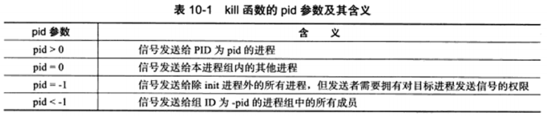
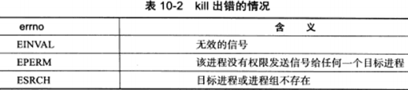
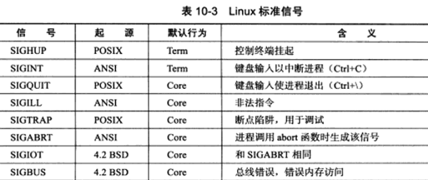
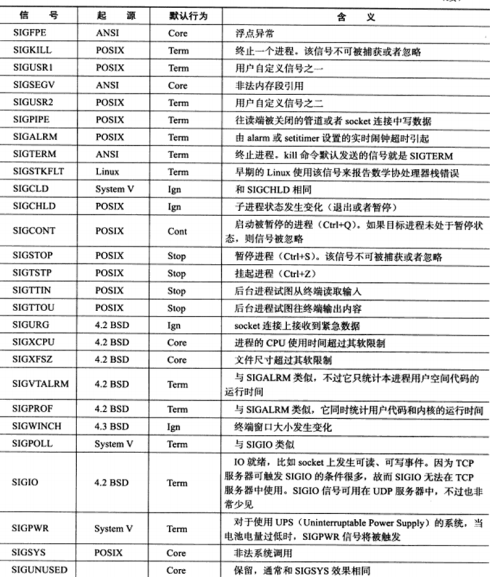
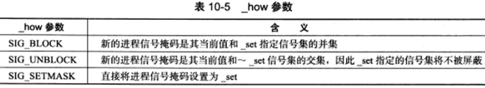

**信号是由用户、系统或者进程发送给目标进程的信息，以通知目标进程某个状态的改变或者系统异常。**

Linux 信号可由如下条件产生：

* 1）**对于前台进程，用户可以通过输入特殊的终端字符来目标进程发送信号**。比如输入 `Ctrl+Z` 来终止进程。
* 2）**系统异常**。比如浮点数异常、非法内存段访问。
* 3）**系统状态变化**。比如 alarm 定时器到期将引起 SIGALRM 信号。
* 4）**运行 kill 命令或者调用 kill 函数。**

**因此服务器程序必须处理或者至少忽略一些常见的信号，以免异常终止。**

***

# 10.1 Linux 信号概述

## 10.1.1 发送信号

```c++
#include <sys/types>
#include <signal.h>
/*	Linux 下，使用 kill 函数来让一个进程来另一个进程发送信号。
	该函数将信号 sig 发送给目标进程，目标进程由参数 pid（进程标识符） 指定。
    Linux 定义的信号值都是大于 0 的，因此 sig 取值为 0 时表示 kill 函数不发送任何信号。但是将 sig 设置为 0 可以用来检测目标进程或进程租是否存在，因为检查工作总是在信号发送之前就执行过。
    函数成功时返回 0，失败则返回 -1 并设置 errno。 */
int kill(pit_t pid, int sig);
```

**pid 的取值和含义如下：**




**kill 出错时 errno 的取值及其含义：**




## 10.1.2 信号处理方式

**信号的默认处理方式有如下几种：**

* 1）**结束进程**：`Tem`
* 2）**忽略信号**：`Ign`
* 3）**结束进程并生成核心转储文件**：`Core`
* 4）**暂停进程**：`Stop`
* 5）**继续进程**：`cont`

```c++
#include <signal.h>
/* 信号处理函数：只有一个整形参数，用该参数来指示信号类型。该信号处理函数应该是可重入的，否则很容易引发一些静态条件。所以在信号处理函数中严禁调用一些不安全的函数。 */
typedef void(*_sighandler_t) (int);

#include <bits/signum.h>
// SIG_DFL 表示使用信号的默认处理方式
#define SIG_DFL ((_sighandler_t) 0)
// SIG_IGN 表示忽略目标信号
#define SIG_IGN ((_sighandler_t) 1)
```


## 10.1.3 Linux 信号

Linux 的可用信号都定义在 `bits/signum.h` 头文件中，其中包括标准信号和 POSIX 实时信号。

Linux 的标准信号如下：






## 10.1.4 中断系统调用

如果程序在执行**处于阻塞状态的系统调用时**，接收到一个信号，并且该信号有信号处理函数，则默认情况下**处于阻塞状态的系统调用**将被中断，并且 errno 被设置为 EINTR。

对上述系统调用被中断的行为，我们可以使用 `sigaction` 函数来为信号设置 `SA_RESTART` 标志以自动重启被该信号中断的系统调用。


# 10.2 信号函数

```c++
#include <signal.h>
/* sig参数指出要捕获的信号类型，_handler 参数用于指定信号 sig 的处理函数。
 signal 函数成功时返回一个函数指针，这个返回值时前一次调用 signal 函数时传入的函数指针，或者是信号 sig 对应的默认处理函数指针 SIG_DEF（如果是第一次调用 signal 的话）
 signal 系统调用出错时返回 SIG_ERR，并设置 errno。 */
_sighandler_t signal(int sig, __sighandler_t _handler)

/* sig 参数指出要捕获的信号类型，act 参数指定新的信号处理方式，oact 参数则输出信号先前的处理方式（如果不为 NULL 的话） */
int sigaction(int sig, struct sigaction* act, struct sigaction* oact)
```


# 10.3 信号集

## 10.3.1 信号集函数

```c++
#include <bits/sigset.h>
#define _SIGSET_NWORDS (1024/(8*sizeof(unsigned long int)))
/* sigset_t 实际上是一个长整型数组，数组的每个元素的每个位表示一个信号。 */
typedef struct
{
	unsigned long int__val[_SIGSET_NWORDS];
}__sigset_t;
```

**Linux 提供了如下一组函数来设置、修改、删除和查询信号集：**

```c++
#include <signal.h>
int sigemptyset(sigset_t* _set);			// 清空数据集
int sigfillset(sigset_t* _set);				// 在信号集中设置所有信号
int sigaddset(sigset_t* _set, int _signo);	// 将信号 _signo 添加至信号集中
int sigdelset(sigset_t* _set, int _signo);	// 将信号 _signo 从信号集中删除
int sigismember(_const sigset_t* _set, int _signo);	// 测试 _signo 是否在信号集中
```


## 10.3.2 进程信号掩码

```c++
#include <signal.h>
/* 	该函数用来设置或查看进程掩码
	_set 参数指定新的信号掩码，_oset 参数则输出原来的信号掩码。
	若 _set 参数不为 NULL，则_how 参数指定设置进程信号掩码的方式如下表所示。
	若 _set 参数为 NULL，则进程信号掩码不变，仍然可以利用 _oset 参数来获得进程当前的信号掩码。
	函数成功时返回 0，失败则返回 -1 并设置 errno。
*/
int sigprocmask(int _how, _const sigset_t* _set, sigset_t* _oset);
```

**_how 参数如下：**




## 10.3.3 被挂起的信号

**设置进程信号掩码后，被屏蔽的信号将不能被进程接收。**如果给进程发送一个被屏蔽的信号，则 OS 将该信号设置为**进程的一个被挂起信号**。如果我们取消对被挂起信号的屏蔽，则该信号就能立即被进程接收到。

**如下函数能获得进程当前被挂起的信号集：**

```c++
#include <signal.h>
/* set 参数用于保存被挂起的信号集。函数成功时返回0，失败时返回 -1 并设置 errno。 */
int sigpending(sigset_t* set);
```


# 10.4 统一事件源


# 10.5 网络编程相关信号

## 10.5.1 SIGHUP

当挂起进程的控制终端时，SIGHUP 信号将被触发。


## 10.5.2 SIGPIPE


## 10.5.3 SIGURG