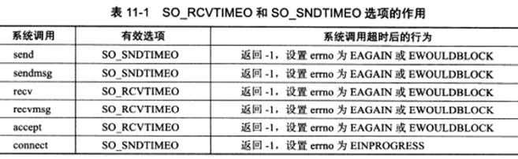
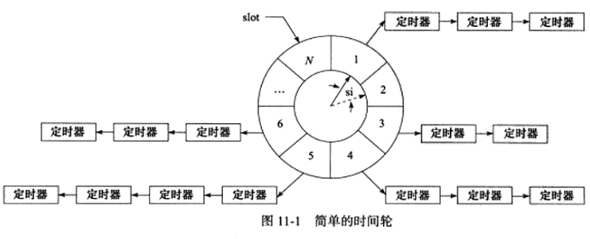

服务器程序通常管理着众多的定时事件，**因此有效地组织这些定时事件，使之在预期时间点被触发且不影响服务器的主要逻辑，对于服务器的性能有着至关重要的影响。**

因此需要将每个定时事件分别封装成定时器，并使用某种容器类数据结构，比如链表、排序链表和时间轮，将所有定时器串联起来，以实现对定时事件的统一管理。

**定时是指在一段时间之后触发某段代码的机制，可以在这段代码中依次处理所有到期的定时器。**

**Linux 提供了三种定时方法：**

* 1）socket 选项 `SO_RCVTIMEO` 和 `SO_SNDTIMEO`。
* 2）`SIGALRM` 信号。
* 3）IO 复用系统调用的超时函数。

# 11.1 socket 选项 SO_RCVTIMEO 和 SO_SNDTIMEO

`SO_RCVTIMEO` 用来设置 socket 接收数据的超时时间；`SO_SNDTIMEO` 用来设置 socket 发送数据的超时时间。

**这两个选项仅对数据接收和发送相关的 socket 专用系统调用（如：send、sendmsg、recv、recvmsg、accept 和 connect）有效果。**

选项 SO_RCVTIMEO 和 SO_SNDTIMEO 对系统调用的影响如下：

# 11.2 SIGALRM 信号

由 `alarm` 和 `setitimer` 函数设置的实时闹钟一旦超时，将会触发 `SIGALRM` 信号。

可以使用 `SIGALRM` 信号的信号处理函数来处理定时任务。但是要处理多个定时任务，就需要不断地触发 `SIGALRM` 信号，并在其信号处理函数中执行到期的任务。

## 11.2.1 基于升序链表的定时器

定时器通常至少包含两个成员：**一个超时时间**（相对时间或者绝对时间）和**一个任务回调函数**。

当然有时候成员还需要**包含回调函数被执行时需要传入的参数，以及是否重启定时器等信息。**

当使用**链表**来作为容器来串联所有的定时器，则每个定时器还需要包含**指向下一个定时器的指针成员**。

***

[升序定时器链表](chapter11/11_2lst_timer.h)该升序链表中的核心函数 tick 相当于是一个心搏函数，它每隔一段固定的时间就执行一次，用来检测并处理到期的任务。

**判断定时任务是否到期的根据是定时器的 expire 值是否小于当前的系统时间。**从系统执行效率来看，**添加定时器的时间复杂度为 O(n)，删除定时器的时间复杂度为 O(1)，执行定时任务的时间复杂度为 O(1)。**

# 11.4 高性能定时器

## 11.4.1 时间轮

**由于采用排序链表的定时器存在效率偏低的问题**，应该我们使用**时间轮**来解决这个问题：

**时间轮的特点如下：**

* 1）时间轮每个槽之间的时间间隔为 si，也就是心博时间，以恒定的速度顺时针转动，每转动一步就指向下一个槽。
* 2）时间轮的每个槽上都连接一个定时器链表，每条链表上的定时器具有相同的特征，也就是它们之间的定时器时间相差走一圈定时轮的时间，即 `N * si * n`，其中 N 表示该时间轮有 N 个槽，n 表示相差的圈数。
* 时间轮采用哈希表的思想，将定时器散列到不同的链表上，这样每条链表上的定时器数目都将明显少于原来排序链表上的定时器数目，插入操作的效率不受定时器数目的影响。
* si 值足够小，能提高定时精度，这样会使定时器更加精确地分类到不同的链表上。N 值足够大，能提高执行效率，这样会使链表的插入操作大大减少，因此能提高效率。

## 11.4.2 时间堆

设计定时器的另外一种思路：**将定时器中超时时间最小的一个定时器的超时值作为新搏间隔。如此一旦心搏函数 tick 被调用，超时时间最小的定时器必然到期，我们就可以在 tick 函数中处理该定时器。然后，再次从剩余的定时器中找出超时时间最小的一个，并将这段最小时间设置为下一次心搏间隔**。如此反复，就实现了较为精确的定时。

使用小根堆就能实现上述思路。

