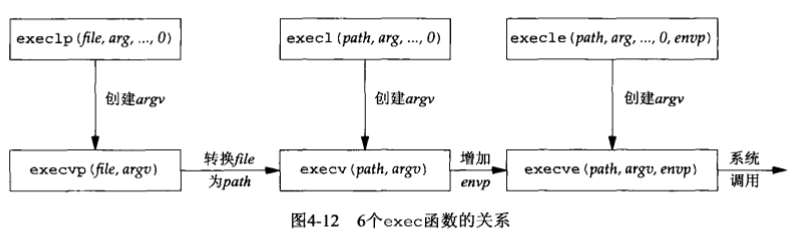
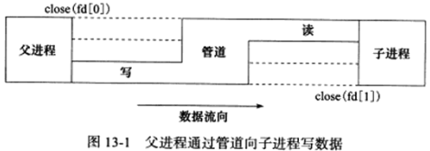

# 13.1 fork 系统调用

**fork 函数复制当前进程，在内核进程表中创建一个新的进程表项。新的进程表项保留了很多与原进程相同的属性**，如堆指针、栈指针和标志寄存器的值。**也有很多属性被赋予新的值**，如该进程的 PPID 被设置成原进程的 PID，信号位图被清除（原进程设置的信号处理函数不再对新进程起作用）。

**子进程的代码与父进程的代码完全相同，同时子进程还会复制父进程的数据，如堆数据、栈数据和静态数据。**但是数据的复制采用**写时复制**，即只有任一进程（父进程或者子进程）对数据进行写操作时，数据复制才会发生（先是发生缺页中断，然后把数据从磁盘调入内存，这样 OS 会给子进程分配内存并复制父进程的数据）。

即使程序中分配了大量的内存，使用 fork 时也需要十分谨慎，尽量避免没必要的内存分配和数据复制。

<font color=alice>创建子进程之后，父进程中打开的文件描述符默认在子进程中也是打开的，且文件描述符的引用计数+1。不仅如此，父进程的用户根目录、当前工作目录等变量的引用计数均会+1。</font>

```c++
#include <sys/types.h>
#include <unistd.h>
/* 每次调用 fork 函数都会返回两次，在父进程中返回的是子进程的 PID，在子进程中则返回的是 0。利用该返回值可以判断当前进程是父进程还是子进程。fork 函数调用失败时返回 -1，并设置 errno。 */
pid_t fork(void);
```


# 13.2 exec 系列系统调用

`fork` 创建子进程后执行的是和父进程相同的程序，子进程往往要调用一种 `exec` 函数来执行另一个程序。当进程调用一种 `exec` 函数后，该进程的用户空间代码和数据完全被新程序替换，`exec` 函数后的代码不会再被执行。调用 `exec` 并不创建新进程，所以调用`exec` 前后该进程的 `id` 不变。



```c++
#include <unistd.h>
extern char** environ;
 
// 加载一个进程，通过 路径+程序名 来加载
// 最后一个参数必须是NULL，标记参数的结束
int execl(const char* path, const char* arg, ...);
如：execl("/bin/ls", "ls", "-l", NULL);
 
// 借助 PATH 环境变量，加载一个进程
// 第一个参数无需给出具体的路径，只需给出函数名即可，系统会在PATH环境变量中寻找所对应的程序，如果没找到的话返回－1。最后一个参数必须是NULL，标记参数的结束
int execlp(const char* file, const char* arg, ...);
如：execlp("ls", "ls", "-l", NULL);    //file, arg[0](程序本身), arg[1], 
 
// l: 希望接收以逗号分隔的参数列表，列表以NULL指针作为结束标志
// e: 函数传递指定参数envp，允许改变子进程的环境，无后缀e时，子进程使用当前程序的环境
int execle(const char* path, const char* arg, ..., char* const envp[]);
如：execle("/bin/ls", "ls", "-a", NULL, NULL);
 
//execv中希望接收一个以NULL结尾的字符串数组的指针：char *argv[] = {"ls", "-a", "-l", NULL};
int execv(const char* path, char* const argv[]);
// 如：execv( "/bin/ls",arg)
int execvp(const char* file, char* const argv[]);
// 如：execvp("ls", argv);
 
//v: 希望接收到一个以NULL结尾的字符串数组的指针
// e: 函数传递指定参数envp，允许改变子进程的环境，无后缀e时，子进程使用当前程序的环境
int execve(const char* path, char* const argv[], char* const envp[]);
// 如：char *const ps_argv[] = {"ps", "-o", "pid, ppid, session, tpgid, comm, NULL"};
char *const ps_envp[] = {"PATH=/bin:/usr/bin", "TERM=console", NULL};
execve("/bin/ps", ps_argv, ps_envp);
```


# 13.3 处理僵尸进程

子进程处于僵尸状态有两种情况：

* 1）在多线程程序中，父进程一般需要跟踪子进程的退出状态。因此**当子进程结束运行后，内核并不会立即释放该子进程的进程表表项，而是供父进程后续对该子进程退出信息的进程表表项进行查询。**<font color=blue>因此，在子进程结束运行之后，父进程读取其状态之前，该子进程被称为僵尸进程。</font>
* 2）父进程结束或异常终止，而子进程继续执行。

```c++
#include <sys/types.h>
#include <sys/wait.h>
pid_t wait(int*stat_loc);
pid_t waitpid(pid_t pid,int*stat_loc,int options); //可以是非阻塞的
```


# 13.4 管道



# 13.5 信号量


# 13.6 共享内存


# 13.7 消息队列


# 13.8 IPC命令


# 13.9 在进程间传递文件描述符

