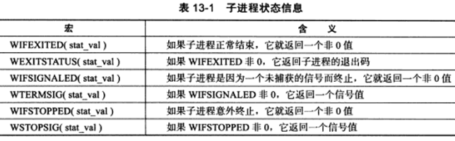
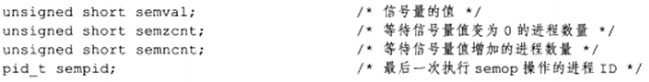
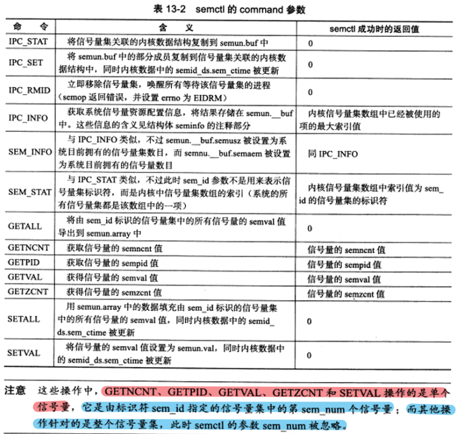
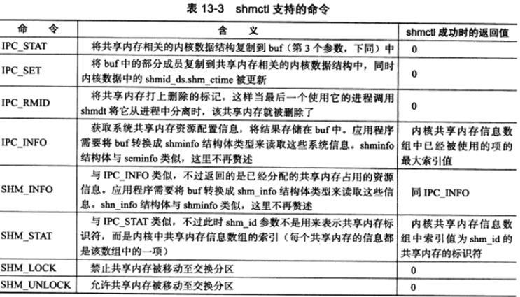
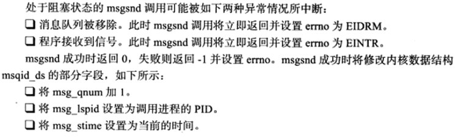
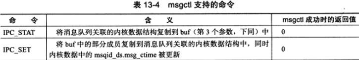
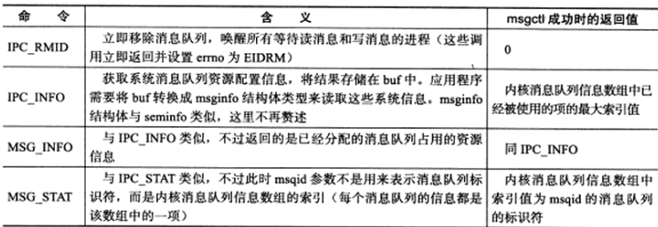
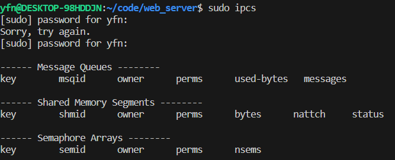

# 13.1 fork 系统调用

**fork 函数复制当前进程，在内核进程表中创建一个新的进程表项。新的进程表项保留了很多与原进程相同的属性**，如堆指针、栈指针和标志寄存器的值。**也有很多属性被赋予新的值**，如该进程的 PPID 被设置成原进程的 PID，信号位图被清除（原进程设置的信号处理函数不再对新进程起作用）。

**子进程的代码与父进程的代码完全相同，同时子进程还会复制父进程的数据，如堆数据、栈数据和静态数据。**但是数据的复制采用**写时复制**，即只有任一进程（父进程或者子进程）对数据进行写操作时，数据复制才会发生（先是发生缺页中断，然后把数据从磁盘调入内存，这样 OS 会给子进程分配内存并复制父进程的数据）。

即使程序中分配了大量的内存，使用 fork 时也需要十分谨慎，尽量避免没必要的内存分配和数据复制。

<font color=alice>创建子进程之后，父进程中打开的文件描述符默认在子进程中也是打开的，且文件描述符的引用计数+1。不仅如此，父进程的用户根目录、当前工作目录等变量的引用计数均会+1。</font>

```c++
#include <sys/types.h>
#include <unistd.h>
/* 每次调用 fork 函数都会返回两次，在父进程中返回的是子进程的 PID，在子进程中则返回的是 0。利用该返回值可以判断当前进程是父进程还是子进程。fork 函数调用失败时返回 -1，并设置 errno。 */
pid_t fork(void);
```


# 13.2 exec 系列系统调用

`fork` 创建子进程后执行的是和父进程相同的程序，子进程往往要调用一种 `exec` 函数来执行另一个程序。当进程调用一种 `exec` 函数后，该进程的用户空间代码和数据完全被新程序替换，`exec` 函数后的代码不会再被执行。调用 `exec` 并不创建新进程，所以调用`exec` 前后该进程的 `id` 不变。


```c++
#include <unistd.h>
extern char** environ;
 
// 加载一个进程，通过 路径+程序名 来加载
// 最后一个参数必须是NULL，标记参数的结束
int execl(const char* path, const char* arg, ...);
如：execl("/bin/ls", "ls", "-l", NULL);
 
// 借助 PATH 环境变量，加载一个进程
// 第一个参数无需给出具体的路径，只需给出函数名即可，系统会在PATH环境变量中寻找所对应的程序，如果没找到的话返回－1。最后一个参数必须是NULL，标记参数的结束
int execlp(const char* file, const char* arg, ...);
如：execlp("ls", "ls", "-l", NULL);    //file, arg[0](程序本身), arg[1], 
 
// l: 希望接收以逗号分隔的参数列表，列表以NULL指针作为结束标志
// e: 函数传递指定参数envp，允许改变子进程的环境，无后缀e时，子进程使用当前程序的环境
int execle(const char* path, const char* arg, ..., char* const envp[]);
如：execle("/bin/ls", "ls", "-a", NULL, NULL);
 
//execv中希望接收一个以NULL结尾的字符串数组的指针：char *argv[] = {"ls", "-a", "-l", NULL};
int execv(const char* path, char* const argv[]);
// 如：execv( "/bin/ls",arg)
int execvp(const char* file, char* const argv[]);
// 如：execvp("ls", argv);
 
//v: 希望接收到一个以NULL结尾的字符串数组的指针
// e: 函数传递指定参数envp，允许改变子进程的环境，无后缀e时，子进程使用当前程序的环境
int execve(const char* path, char* const argv[], char* const envp[]);
// 如：char *const ps_argv[] = {"ps", "-o", "pid, ppid, session, tpgid, comm, NULL"};
char *const ps_envp[] = {"PATH=/bin:/usr/bin", "TERM=console", NULL};
execve("/bin/ps", ps_argv, ps_envp);
```


# 13.3 处理僵尸进程

子进程处于僵尸状态有两种情况：

* 1）在多线程程序中，父进程一般需要跟踪子进程的退出状态。因此**当子进程结束运行后，内核并不会立即释放该子进程的进程表表项，而是供父进程后续对该子进程退出信息的进程表表项进行查询。**<font color=blue>因此，在子进程结束运行之后，父进程读取其状态之前，该子进程被称为僵尸进程。</font>
* 2）父进程结束或异常终止，而子进程继续执行。

```c++
#include <sys/types.h>
#include <sys/wait.h>
/* 以下两个函数在父进程中调用，以等待子进程的结束，并获取子进程的返回信息，从而避免了僵尸进程的产生，或者使子进程的僵尸态立即结束。 */
/* wait 函数将阻塞进程，直到该进程的某个子进程结束运行为止。该函数的返回值是结束运行子进程的PID，并将该子进程的退出状态信息存储在 stat_loc 参数指向的内存中。 */
pid_t wait(int* stat_loc);

/* waitpid 只等待由 pid 参数指定的子进程，当 pid 取值为 -1 时，waitpid 与 wait 函数相同了。
stat_loc 是用来保存子进程退出时的状态信息。
options 可以用来控制 waitpid 函数。其最常用的取值是 WNOHANG，表示 waitpid 调用僵尸非阻塞的。 */
pid_t waitpid(pid_t pid,int* stat_loc,int options);
```

`sys/wait.h` 头文件中定义了几个宏来帮助解释子进程的退出状态信息：




# 13.4 管道

管道能在父、子进程间传递数据，利用的是 fork 调用之后的两个管道文件描述符都保持打开。**由于管道采用半双工通信，因此要实现父、子进程之间的双向数据传输，就必须使用两个管道。**


# 13.5 信号量

## 13.5.1 信号量原语

信号量是一种特殊的变量，**它只能取自然数值并且只支持两种操作：等待（wait）和信号（signal）。**

<font color=blue>Linux 信号量的 API 都定义在 `sys/sem.h` 头文件中，主要包含三个系统调用：`semget`、`semop` 和 `semctl`。</font>这三个系统调用是一组信号量，也就是信号量集，不是单个信号量。


## 13.5.2 semget 系统调用

```c++
#include <sys/sem.h>
/* semget 系统调用用来创建一个新的信号量集，或者获取一个已经存在的信号量集。 */
/* key 参数是一个键值，用来标识一个全局唯一的信号量集。要通过信号量通信的进程需要使用相同的键值来创建/获取该信号量。
num_sems 参数指定要创建/获取的信号量集中信号量的数目。如果要创建信号量，则该值必须被指定；如果是要获取已经存在的信号量，则需要把该值设置为 0。
sem_flags 参数指定一组标志。其低端的 9 个比特是该信号量的权限，还可以与 IPC_CREAT 标志按位"或"运算以创建新的信号量集。
semget 成功是就返回一个正整数值，是信号量集的标识符；失败就返回 -1，并设置 errno。*/
int semget(key_t key, int num_sems, int sem_flags);
```

如果 semget 用于创建信号量集，则与之关联的内核数据结构体 **semid_ds** 将被创建并初始化：

```c++
#include <sys/sem.h>
/* 该结构体用于描述 IPC 对象（信号量、共享内存和消息队列）的权限 */
struct ipc_perm
{
    key_t key;		// 键值
    uid_t uid;    	// 所有者的有效用户ID
    gid_t gid;    	// 所有者的有效组ID
    uid_t cuid;    	// 创建者的有效用户ID
    gid_t cgid;    	// 创建者的有效组ID
    mode_t mode;   	// 访问权限
};
 
struct semid_ds
{
    struct ipc_perm sem_perm;        	// 信号量的操作权限
    unsigned long int sem_nsems;    	// 该信号量集中的信号量数目
    time_t sem_otime;                	// 最后一次调用semop的时间
    time_t sem_ctime;                	// 最后一次调用semctl的时间
};
```


## 13.5.3 semop 系统调用

**与每个信号量关联的一些内核变量：**



```c++
#include <sys/sem.h>
/* semop 系统调用是通过执行 P、V 操作来改变信号量的值。semop 对信号量的操作实际上就是对这些内核变量的操作。 */
/* sem_id 参数是由 semget 调用返回的信号量集标识符，用以指定被操作的目标信号量集。
sem_ops 参数指向一个 sembuf 结构体的数组。
num_sem_ops 参数指定要执行的操作个数，即 sem_ops 数组中元素的个数。
semop 对数组 sem_ops 中的每个成员按照数组顺序依次执行操作，并且该过程是原子操作。 */
// semop 成功时返回 0，失败则返回 -1 并设置 errno，失败时，sem_ops 数组中指定的所有操作都不被执行。
int semop(int sem_id, struct sembuf* sem_ops, size_t num_sem_ops);

struct sembuf
{
    /* 表示信号量集中信号量的编号，0 表示为信号量集中的第一个信号量。 */
	unsigned short int sem_num;
    /* 指定操作类型，其可选值为正整数、0和负整数。 */
    short int sem_op;
    /* sem_flg 的可选值是 IPC_NOWAIT 和 SEM_UNDO。IPC_NOWAIT 的含义是：无论信号量操作是否成功，semop 调用都将立即返回，这类似于非阻塞 IO 操作。SEM_UNDO 的含义是：当进程退出时取消正在进行的 semop 操作。 */
    short int sem_flg;
};
```


## 13.5.4 semctl 系统调用

```c++
#include <sys/sem.h>
/* semctl 系统调用允许调用者对信号量进行直接控制：
sem_id 参数是由 semget 调用返回的信号量集标识符，用以指定被操作的信号量集。
sem_num 参数指定被操作的信号量在信号量集中的编号。 
command 参数指定要执行的命令。
有的命令需要调用者传递第 4 个参数，在 sys/sem.h 头文件中有它的推荐格式。*/
// semctl 成功是的返回值取决于 command 参数，失败则返回 -1 并设置 errno。
int semctl(int sem_id, int sem_num, int command, ...);

union semun
{
    int val;    			//用于SETVAL命令
    struct semid_ds* buf;   //用于IPC_STAT和IPC_SET命令
    unsigned short* array;  //用于GETALL和SETALL命令
    struct seminfo* __buf;  //用于IPC_INFO命令
};
 
struct seminfo
{
    int semmap;         //linux内核没有使用
    int semmni;         //系统最多可以拥有的信号量集数目
    int semmns;         //系统最多可以拥有的信号量数目
    int semmnu;         //Linux内核没有使用
    int semmsl;         //一个信号量集最多允许包含的信号量数目
    int semopm;         //semop一次最多能执行的sem_op操作数目
    int semume;         //Linux内核没有使用
    int semusz;         //sem_undo结构体大小
    int semvmx;         //最大允许的信号量值
    int semaem;         //最多允许的UNDO次数（带SEM_UNDO标志的semop操作次数）
};
```

**`semctl` 支持的所有命令如下表：**




## 13.5.5 特殊键值 IPC_PRIVATE

<font color=blue>给 semget 传递一个键值 `IPC_PAIVATE`（其值为0），这样无论该信号量是否已经存在，semget 都将创建一个新的信号量。</font>可以使用该键值，实现父、子进程之间的信号量同步。


# 13.6 共享内存

<font color=alice>共享内存是最高效的 IPC 机制，因为它不涉及进程之间的任何数据的传输。共享内存通常和其他进程间的通信方式一起使用。</font>

Linux 共享内存的 API 都定义在 `sys/shm.h` 头文件中，包括四个系统调用：`shmget`、`shmat`、`shmdt` 和 `shmctl`。


## 13.6.1 shmget 系统调用

```c++
#include <sys/shm.h>
/* shmget 系统调用创建一段新的共享内存，或者获取一段已经存在的共享内存。 */
/* key 参数是一个键值，用来标识一段全局唯一的共享内存。
size 参数指定共存的大小，单位是字节。如果创建新的共享内存，则 size 值必须被指定。如果是获取已经存在的共享内存，则可以把 size 设置为 0。
shmflg 参数的使用和含义与 semget 系统调用的 sem_flags 参数相同。
shmget 成功时返回一个正整数值，它是共享内存的标识符。失败则返回 -1，并设置 errno。 */
int shmget(key_t key, size_t size, int shmflg);
```

<font color=blue>若 shmget 用于创建共享内存，则这段共享内存的所有字节都被初始化为 0，与之关联的内核数据结构 shmid_ds 将被创建并初始化。</font>

```c++
struct shmid_ds
{
    struct ipc_per shm_perm;	// 共享内存的操作权限
    size_t shm_segsz;    		// 共享内存的大小，单位是字节
    __time_t shm_atime;    		// 对这段内存最后一次调用shmat的时间
    __time_t shm_dtime;    		// 对这段内存最后一次调用shmdt的时间
    __time_t shm_ctime;    		// 对这段内存最后一次调用shmctl的时间
    __pid_t shm_cpid;    		// 创建者的PID
    __pid_t shm_lpid;    		// 最后一次执行shmat或shmdt操作的进程的PID
    shmatt_t shm_nattach;    	// 目前关联到此共享内存的进程数量
};
```

shmget 对 shmid_ds 结构体的初始化包括：

* 1）将 shm_perm.cuid 和 shm_perm.uid 设置为调用进程的有效用户 ID。
* 2）将 shm_perm.cgid 和 shm_perm.gid 设置为调用进程的有效组 ID。
* 3）将 shm_perm.mode 的最低 9 位设置为 shmflg 参数的最低 9 位。
* 4）将 shm_segsz 设置为 size。
* 5）将 shm_lpid、shm_nattach、shm_atime、shm_dtime 设置为 0。
* 6）将 shm_ctime 设置为当前时间。


## 13.6.2 shmat 和 shmdt 系统调用

```c++
#include <sys/shm.h>
/* 函数功能：将共享内存关联到进程的地址空间中。
其中：shm_id 参数是由 shmget 调用返回的共享内存标识符。shm_addr 参数将共享内存关联到进程的某块地址空间上，不过最终效果还是要受到 shmflg 参数的可选标志 SHM_RND 的影响。
shmat 成功时返回共享内存被关联到的地址，失败则返回 (void*)-1 并设置 errno。 */
void *shmat(int shm_id, const void* shm_addr, int shmflg);

/* 函数功能：将关联到 shm_addr 处的共享内存从进程中分离。
函数成功时返回 0，失败则返回 -1 并设置 errno。 */
int shmdt(const void* shm_addr);
```


## 13.6.3 shmctl 系统调用

```c++
#include <sys/shm.h>
/* 控制共享内存的某些属性。
其中：shm_id 参数是由 shmget  调用返回的共享内存标识符，command 参数指定要执行的命令。 shmctl 成功时的返回值取决于 commmand 参数，失败则返回 -1 并设置 errno。 */
int shmctl(int shm_id, int conmand, struct shmid_ds* buf);
```

**shmctl 支持的命令：**




## 13.6.4 共享内存的 POSIX 方法

**若在代码中使用下面两个 POSIX 共享内存函数，则在编译时需要指定连接选项 `-lrt`。**

```c++
#include <sys/mman.h>
#include <sys/stat.h>
#include <fcntl.h>
/* 利用 mmap 在无关进程之间共享内存的方式，这种方式无须任何文件的支持。 */
/* shm_open 的使用方法与 open 系统调用完全相同。name 参数指定要创建 / 打开的共享内存对象；oflag 参数指定创建方式。
shm_open 调用成功时返回一个文件描述符，该文件描述符可用于后续的 mmap 调用，从而将共享内存关联到调用进程。失败则返回 -1，并设置 errno。 */
int shm_open(const char* name, int oflag, mode_t mode);

/* 函数功能：将 name 参数指定的共享内存对象标记为等待删除。当所有使用该共享内存对象的进程都使用 ummap 将他从进程中分离之后，系统将销毁这个共享内存对象所占据的资源。 */
int shm_unlink(const char* name);
```


# 13.7 消息队列

**消息队列是在两个进程之间传递二进制块数据的一种简单有效的方式。**每个数据块都有一个特定的类型，接收方可以根据类型来有选择地接收数据，**而不一定像管道和命名管道那样必须以先进先出的方式接收数据。**

Linux 消息队列的 API 都定义在 `sys/msg.h` 头文件中，包括四个系统调用：`msgget`、`msgsnd`、`msgrcv` 和 `msgctl`。


## 13.7.1 msgget 系统调用

```c++
#include <sys/msg.h>
/* msgget 系统调用用于创建一个消息队列，或者获取一个已有的消息队列。
key 参数是一个键值，用来表示一个全局唯一的消息队列。
msgflg 参数指定一组标志。其低端的 9 个比特是该信号量的权限，还可以与 IPC_CREAT 标志按位"或"运算以创建新的信号量集。
mssget 成功时返回一个正整数值，这个正整数值是消息队列的标识符。msgget 失败时返回 -1，并设置 errno。 */
int msgget(key_t key, int msgflg);
```

如果 msgget 用于创建消息队列，则与之关联的内核数据结构 **msqid_ds** 将被创建并初始化（内核为每个消息队列维护着一个结构，结构名为 msqid_ds，里面存放着消息队列的大小，pid，存放时间等一些参数）：

```c++
struct msqid_ds
{
    struct ipc_perm msg_perm;    //	消息队列的操作权限
    time_t msg_stime;            //	最后一次调用msgsnd的时间
    time_t msg_rtime;            //	最后一次调用msgrcv的时间
    time_t msg_ctime;            //	最后一次被修改的时间
    unsigned long __msg_cbytes;  //	消息队列中已有的字节数
    msgqnum_t msg_qnum;          //	消息队列中已有的消息数
    msglen_t msg_qbytes;         //	消息队列允许的最大字节数
    pid_t msg_lspid;             //	最后执行msgsnd的进程的PID
    pid_t msg_lrpid;             //	最后执行msgrcv的进程的PID
};
```


## 13.7.2 msgsnd 系统调用

```c++
#include <sys/msg.h>
/* msgsnd 把一条消息添加到消息队列中。
msqid 参数由 msgget 调用返回的消息队列标识符。
msg_ptr 参数指向一个准备发送的消息，消息是一个名为 msgbuf 的结构体。
msg_sz 参数是消息的数据部分的长度。长度可以设置为 0，表示没有消息数据。 
msgflg 参数控制 msgsnd 的行为，它通常仅支持 IPC_NOWAIT 标志，即以非阻塞带外方式发送数据。默认情况下，发送消息时如果消息队列满了，则 msgsnd 将被阻塞。若 IPC_NOWAIT 标志被指定，则 msgsnd 将立即返回被设置 errno 为 EAGAIN。 */
int msgsnd(int msqid, const void * msg_ptr, size_t msg_sz, int msgflg);

struct msgbuf
{
	long mtype;			// 消息类型。其值必须是一个正整数。
    char mtext[512];	// 消息数据。
};
```




## 13.7.3 msgrcv 系统调用

```c++
#include <sys/msg.h>
/* msgrcv 从消息队列中获取消息。
msqid 参数是由 msgget 调用返回的消息队列标识符。 
msg_ptr 参数用于存储接收的消息。
msg_sz 参数指的是消息数据部分的长度。
msgtype 参数指定接收何种类型的消息。*/
int msgrcv(int msqid, void* msg_ptr, size_t msg_sz, long int msgtype, int msgflg);
```


## 13.7.4 msgctl 系统调用

```c++
#include <sys/msg.h>
/* msgctl 用于控制消息队列的某些属性。
msqid 参数是由 msgget 调用返回的共享内存标识符。command 参数指定要执行的命令。 
msgctl 成功时的返回值取决于 command 参数。失败时就返回 -1 并设置 errno。 */
int msgctl(int msqid, int command, struct msqid_ds* buf);
```

`msgctl` 支持的命令如下表所示：






# 13.8 IPC命令

使用 `ipcs` 命令来观察系统上拥有共享资源的实例：

```bash
sudo ipcs
```




# 13.9 在进程间传递文件描述符

**fork 之后在父进程中的文件描述符在子进程中任然能保持打开。**

<font color=blue>注意：传递一个文件描述符并不是传递一个文件描述符的值，而是要在接收进程中创建一个新的文件描述符，并且该文件描述符和发送进程中被传递的文件描述符指向内核中相同的文件表项。</font>

在 NUIX 下可以使用 socket 在进程间传递文件描述符。