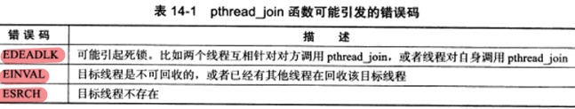
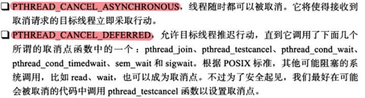
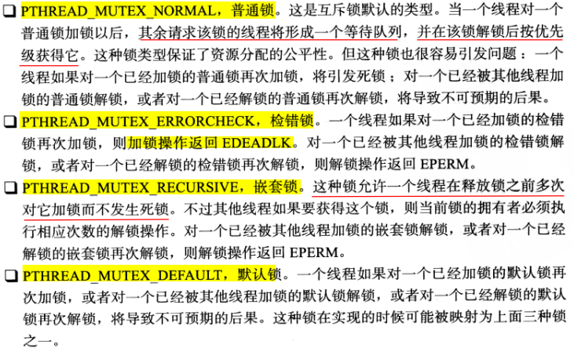

# 14.1 Linux 线程概述

## 14.1.1 线程模型

线程是程序中完成一个独立任务的完整执行序列，即一个可调度的实体。**线程是独立调度的基本单位，进程是拥有资源的基本单位。**

根据运行环境和调度者的身份，线程可分为内核线程和用户线程：

* 1）内核线程：运行在内核空间，由内核来调用，也称为轻量级进程（LWP）。
* 2）用户线程：运行在用户空间，由线程库来调度。

***

<font color=blue>线程的实现方式可分为三种模式：完全在用户空间实现、完全由内核调度和双层调度。</font>

a）**完全在用户空间实现：**这种方式实现的线程无需内核的支持，内核甚至根本不知道这些线程的存在。线程库利用 `longjmp` 来切换线程的执行，线程库负责管理所有执行线程，比如：线程的优先级、时间片等。**这种实现方式，相等于是M:1，也就是 M 个用户空间线程对应一个 1 个内核线程，实际上内核线程就是进程自己。**

* 优点：用户线程的切换也是由线程库函数来完成的，无需用户态与内核态的切换，所以速度特别快。
* 缺点： 一个进程中的多个线程只能调度到一个CPU，这种约束限制了可用的并行总量。如果某个线程执行了一个“阻塞式”操作（如read），那么，进程中的所有线程都会阻塞，直至那个操作结束。

b）**完全由内核调度**：满足M:N = 1:1，即 1 个用户线程被映射为 1 个内核线程。 在1:1核心线程模型中，应用程序创建的每一个线程（也有书称为LWP）都由一个核心线程直接管理，也就是说一个用户线程对应一个内核线程。OS内核将每一个核心线程都调到系统CPU上。由于这种线程的创建与调度由内核完成，所以这种线程的系统开销比较大（但一般来说，比进程开销小）。

c）**双层调度模式**：内核调用 N 个内核线程，线程库调度 M 个用户线程。这种线程实现方式结合了前两种方式的优点：不但不会消耗过多的内核资源，而且线程切换速度也较快，同时它也可以充分利用多处理器的优势。


## 14.1.2 Linux 线程库

现代 Linux 默认使用的线程库是NPTL（Next Generation POSIX Threads），是采用1:1方式实现的。

```bash
# 用户可以使用该命令查看当前系统使用的线程库：
getconf GNU_LIBPTHREAD_VERSION
```

NPTL的主要有以下几个优点：

* 1）内核线程不再是一个进程，因此避免了很多用进程模拟内核线程导致的语义问题。
* 2）摒弃了管理线程，终止线程、回收线程堆栈等工作都可以由内核来完成。
* 3）一个进程的线程可以运行在不同的CPU上，能充分利用多处理器的系统的优势。
* 4）线程的同步由内核完成。隶属于不同进程的线程之间也可能共享互斥锁，因此可实现跨进程的线程同步。


# 14.2 创建线程和结束线程

```c++
#include <pthread.h>
#include <bits/pthreadtypes.h>

/* 函数共能：创建一个线程。
thread 参数是新线程的标识符；attr 参数用于设置新线程的属性。
start_routinw 参数指定新线程将运行的函数；arg 参数执行新线程将运行的参数。
函数调用成功是返回 0，失败时则返回错误码。
*/
/* 一个用户可以打开的线程数量是有限的，系统上所有用户创建的线程总数不能超过/proc/sys/kernel/threads-max内核参数定义的值。*/
int pthread_create(pthread_t* thread, const pthread_attr_t* attr, void* (*start_routine)(void*), void* arg); 

/* pthread_t的定义如下，是一个整数类型。实际上，Linux 上几乎所有的资源标识符都是一个整型数，如 socket、各种 IPC 标识符等。 */
typedef unsigned long int pthread_t;

/* 在线程中禁止调用 exit 函数，否则会导致整个进程退出，取而代之的是调用 pthread_exit 函数，这个函数是使一个线程退出。线程一旦内创建好，内核就可以调度内核线程来执行 start_routine 函数指针所指的函数了。线程函数在结束时需调用pthrea_exit()，确保安全、干净的退出。 */
/* retval：可以指向任何类型的数据，它指向的数据将作为线程退出时的返回值。如果线程不需要返回任何数据，将 retval 参数置为 NULL 即可。但是不能指向函数内部的局部数据。
函数通过 retval 参数向线程的回收者传递其退出信息。执行完之后不会返回到调用者，而且永远不会失败。 */
void pthread_exit(void* retval);

/* 一个进程中的所有线程都可以调用 pthread_join 函数来回收（前提是目标线程是可回收的），即等待其他线程结束为止。
thread 参数是目标线程的标识符，retal 参数则是目标线程返回的退出信息。
该函数会一直阻塞，直到被回收的线程结束为止。该函数成功时返回 0，失败则返回错误码。可能的错误码如下表 14-1。 */
int pthread_join(pthread_t thread, void** retval);

/* 该函数功能是取消线程。thread 参数是目标线程的标识符。
thread 参数是目标线程的标识符。该函数成功时返回 0，失败则返回错误码。 */
int pthread_cancel(pthread_t thread);

/* 以下两个函数用来决定接收到取消信号的目标线程是否允许被取消以及如何取消。*/
/* 这两个函数的第一个参数分别用于设置线程的取消状态（是否允许取消）和取消类型（如何取消），第二个参数则分别记录线程原来的取消状态和取消类型的。
函数成功时返回 0，失败则返回错误码。 */
int pthread_setcancelstate(int state, int *oldstate);
int pthread_setcanceltype(int type, int *oldtype);
```

**pthread_join 函数可能引发的错误码：**




**`pthread_setcancelstate`函数的 state 参数的两个可选值：**


**`pthread_setcanceltype` 函数的 type 参数的两个可选值：**



# 14.3 线程属性

`pthread_attr_t` 结构体定义了一套完整的线程属性：

```c++
#include <bits/pthreadtypes.h>
#define __SIZEOF_PTHREAD_ATTR_T 36
typedef union
{
    char __size[__SIZEOF_PTHREAD_ATTR_T];
    long int __align;
}pthread_attr_t;

/* 由上面结构体可知，各种线程属性全部包含在一个字符数组中。线程库定义了一系列函数来操作 pthread_attr_t 类型的变量，以便我们获取和设置线程属性。 */
#include <pthread.h>
// 初始化线程属性对象
int pthread_attr_init(pthread_attr_t* attr);
// 销毁线程属性对象。被销毁的线程属性对象只有再次初始化之后才能继续使用
int pthread_attr_destroy(pthread_attr_t* attr);

int pthread_attr_getdetachstate(const pthread_attr_t* attr, int* detachstate);
int pthread_attr_setdetachstate(pthread_attr_t* attr, int detachstate);
 
int pthread_attr_getstackaddr(const pthread_attr_t* attr, void** stackaddr);
int pthread_attr_setstackaddr(pthread_attr_t* attr, void* stackaddr);
 
int pthread_attr_getstacksize(const pthread_attr_t* attr, size_t* stacksize);
int pthread_attr_setstacksize(pthread_attr_t* attr, size_t stacksize);
 
int pthread_attr_getstack(const pthread_attr_t* attr, void** stackaddr, size_t* stacksize);
int pthread_attr_setstack(pthread_attr_t* attr, void* stackaddr, size_t stacksize);
 
int pthread_attr_getguardsize(const pthread_attr_t* attr, size_t* guardsize);
int pthread_attr_setguardsize(pthread_attr_t* attr, size_t guardsize);
 
int pthread_attr_getschedparam(const pthread_attr_t* attr, struct sched_param* param);
int pthread_attr_setschedparam(pthread_attr_t* attr, const struct sched_param* param);
 
int pthread_attr_getschedpolicy(const pthread_attr_t* attr, int* policy);
int pthread_attr_setschedpolicy(pthread_attr_t* attr, int policy);
 
int pthread_attr_getinheritsched(const pthread_attr_t* attr, int* inherit);
int pthread_attr_setinheritsched(pthread_attr_t* attr, int inherit);
 
int pthread_attr_getscope(const pthread_attr_t* attr, int* scope);
int pthread_attr_setscope(pthread_attr_t* attr, int scope);
```

关于各个线程的属性可查看书中 `14.3 线程属性` 部分进行仔细阅读。


# 14.4 POSIX 信号量

在 Linux 上，信号量 API 有两组。一组是在第 13 章中讨论的 `System V IPC` 信号量，另外一组是 `POSIX` 信号量。

# 14.5 互斥锁

互斥锁（互斥量）可以用于保护关键代码段，以确保其独占式的访问。

* 1）当进入关键代码时，需要获得互斥锁并将其加锁，相等于是二进制信号量的 P 操作。
* 2）当离开关键代码时，用来唤醒其他等待该互斥锁的线程，相当于是二进制信号量的 V 操作。


## 14.5.1 互斥锁基础 API

```c++
#include <pthread.h>
/* 如下函数的第一个参数 mutex 指向要操作的目标互斥锁，互斥锁的类型是 pthread_mutex_t 结构体。
下面这些函数成功时返回 0，失败则返回错误码。 */
/* 初始化互斥锁。mutexattr 指定互斥锁的属性，如果将它设置为NULL，表示使用默认属性。*/
int pthread_mutex_init(pthread_mutex_t* mutex, const pthread_mutexattr_t* mutexattr);
/* 还可以用这种方式初始化互斥锁。宏 PTHREAD_MUTEX_INITALIZER 实际上只是把互斥锁的各个字段都初始化为 0。 */
pthread_mutex_t mutex = PTHREAD_MUTEX_INITALIZER;
 
/* 销毁互斥锁，以释放其占用的内核资源。销毁一个已经加锁的互斥锁将导致不可预期的后果。 */
int pthread_mutex_destroy(pthread_mutex_t* mutex);
 
/* 以原子操作的方式给一个互斥锁加锁。如果目标互斥锁已经被锁，则 pthread_mutex_lock 将阻塞，直到该互斥锁的占有者将其解锁。 */
int pthread_mutex_lock(pthread_mutex_t* mutex);
 
/* pthread_mutex_lock() 的非阻塞版本。它始终立即返回，而不论被操作的互斥锁是否已经被加锁。当目标互斥锁未被加锁时，它对互斥锁执行加锁操作。当互斥锁已经被加锁时，它将返回错误码EBUSY。（注意：这里讨论的pthread_mutex_lock和pthread_mutex_trylock的行为是针对普通锁而言的，对于其他类型的锁，这两个加锁函数会有不同的行为）*/
int pthread_mutex_trylock(pthread_mutex_t* mutex);
 
/* 以原子操作的方式给一个互斥锁解锁。如果此时有其它线程正在等待这个互斥锁，则这些线程中的某一个将获得它。 */
int pthread_mutex_unlock(pthread_mutex_t* mutex);
```


## 14.5.2 互斥锁属性

`pthread_mutexattr_t` 结构体定义了一套完整的互斥锁属性。可以通过如下函数来获取和设置互斥锁属性：

```c++
#include <pthread.h>
 
// 初始化互斥锁属性对象
int pthread_mutexattr_init(pthread_mutexattr_t* attr);
 
// 销毁互斥锁属性对象
int pthread_mutexattr_destroy(pthread_mutexattr_t* attr);
 
// 互斥锁有两种常用的属性：pshared 和 type。
 
// 获取和设置互斥锁的 pshared 属性
int pthread_mutexattr_getpshared(const pthread_mutexattr_t* attr, int* pshared);
int pthread_mutexattr_setpshared(pthread_mutexattr_t* attr, int pshared);
 
// 获取和设置互斥锁的 type 属性
int pthread_mutexattr_gettype(const pthread_mutexattr_t* attr, int* type);
int pthread_mutexattr_settype(pthread_mutexattr_t* attr, int type);
```

**互斥锁属性 pshared 指定是否允许跨进程共享互斥锁，其可选值有两个：**


**互斥锁属性 type 指定互斥锁的类型。Linux 支持如下的 4 种类型的互斥锁：**




# 14.6 条件变量


# 14.7 线程同步机制包装类


# 14.8 多线程环境

