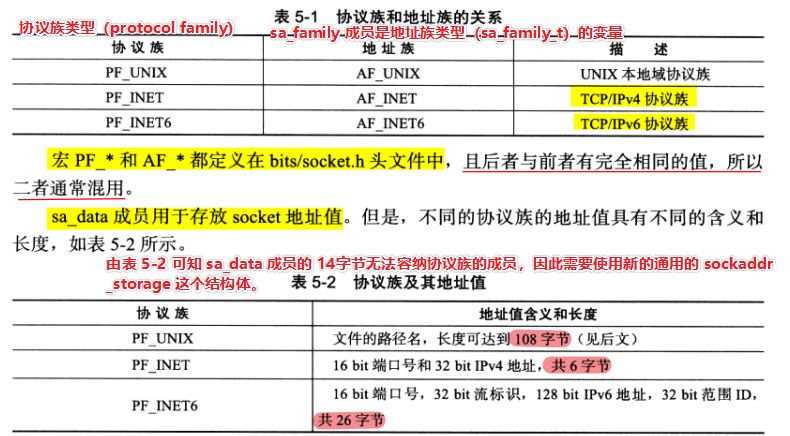

# 5.1 socket 地址 API

**Linux API 分为三种：**

1）**socket 地址 API：**由一个 IP 地址和端口对（**ip，port**），唯一地表示使用 TCP 通信的一端。也被称为 socket 地址。

2）**socket 基础 API：**socket 的主要 API 都定义在 **sys/socket.h** 文件中，包括创建 socket、命名 socket、监听 socket、接受连接、发起连接、读写数据、获取地址信息、检测带外标记，以及读取和设置 socket 选项。

3）**网络信息 API：**用来实现主机名和 IP 地址之间的转换，以及服务名称和端口号之间的转换。这些 API 被定义在 **netdb.h** 文件中。


## 5.1.1 主机字节序和网络字节序

<font color=blue>现代 CPU 的 ACC（累加器）一次都能装载至少 4 字节，字节序分为大端字节序（big endian）和小端字节序（little endian）。</font>

**小端字节序：低位字节在前，高位字节在后。**由于现代 PC（计算机）大多采用小端字节序，因此小端字节序又被称为**主机字节序**。

**大端字节序：高位字节在前，低位字节在后。**由于格式化数据在两台使用不同字节序的主机之间直接传递时，接收端必然错误地解释之。因此大端字节序也被称为**网络字节序，用来给所有接受的主机提供了一个正确解释收到的格式化数据的保证。**

```c++
#include <netinet/in.h>
/*
以下四个函数来完成主机字节序和网络字节序之间的转换：
	如 htonl 表示"host to network long"，即将长整型（32bit）的主机字节序数据转换网络字节序数据。
    如 ntohl 表示"network to host long"，即将长整形（32bit）的网络字节序数据转换主机字节序数据。
*/
/*这四个函数中：长整型函数通常用来转换 ip 地址，短整型函数用来转换端口地址*/
unsigned long int htonl(unsigned long int hostlong);
unsigned short int htons(unsigned short int hostshort);
unsigned long int ntohl(unsigned long int netlong);
unsigned short int ntohs(unsigned short int netshort);
```


## 5.1.2 通用 socket 地址

```c++
#include <bits/socket.h>
/*
socket 网络编程接口中表示 socket 地址的是结构体 sockaddr：
	sa_family 成员是地址族类型（sa_family_t）的变量，地址族类型（sa_family）通常与协议族类型（protocol family，也称为 domain）对应。对应关系可参考表 5-1。
	sa_data 成员用于存放 socket 地址值。但是不同协议族的地址值具有不同的含义和长度，可参考表 5-2。
*/
struct sockaddr
{
    sa_family_t sa_family;
    char sa_data[14];
};

/*
用来解决结构 sockaddr 中成员 sa_data 无法容纳多数协议族的地址值，而使用下面这个新的通用的 socket 地址结构体。
这个结构体不仅提供了足够大的空间用来存放地址值，而且是内存对齐的（这是由于 __ss_align 成员的作用）。
*/
struct sockaddr_storage
{
	sa_family_t sa_family;
    unsigned long int __ss_align;
    char __ss_padding[128-sizeof(__ss_align)];
};
```




## 5.1.3 IP 地址转换函数

```C++
#include <arpa/inet.h>

/*将点分十进制字符串表示的 IPv4 地址转换为用网络*/
int_addr_t inet_addr(const char* strptr);

/**/
int inet_aton(const char* cp, struct in_addr* inp);

/**/
char* inet_ntoa(struct in_addr in);
```


# 5.2 创建socket
UNIX/Linux 的一个哲学是：一切东西皆文件。

```c++
/*
	domain 参数告诉系统使用哪个底层协议族。对于 TCP/IP 协议族而言，该参数应设置为 PF_INET（用于 IPv4）或PF_INET6（用于 IPv6）；对于 UNIX 本地协议族而言，该参数应该设置为 PF_UNIX。
	type 参数指定服务类型。对于 TCP/IP 协议族而言，其值取 SOCK_STREAM 并表示传输层使用 TCP 协议，取 SOCK_DGRAM 表示传输层使用 UDP 协议。
	protocol 参数是在前两个参数构成的协议集合下，再选择一个具体的协议。一般设置为 0，表示使用默认协议。
	socket 系统调用成功时返回一个 socket 文件描述符，失败则返回 -1 并设置 errno。
*/
int socket(int domain, int type, int protocol);
```


# 5.3 命名 socket

<font color=blue>将一个 socket 与 socket 地址绑定称为给**socket命名**。</font>

<font color=alice>在服务器程序中，通常需要命名 socket，因为只有命名了 socket 后客户端才知道如何连接它。客户端则通常不需要命名 socket，而是采用**匿名方式**，即使操作系统自动分配的 socket 地址。</font>

```c++
/*
命名 socket 的系统调用是使用 bind() 函数：
	bind 将 my_addr 所指的 socket 地址分配未命名的 sockfd 文件描述符，addrlen 参数指出该 socket 地址的长度。
	
bind 成功时返回 0，失败则返回 -1 并设置 errno。其中两种常见的 errno 是 EACCES 和 EADDRINUSE，其含义分别如下：
	EACCES：被绑定的地址是受保护的地址，仅超级用户能够访问。比如普通用户将 socket 绑定到知名服务端口（端口号为0~1023）上时，bind 将返回 EACCES 错误。
	EADDRINUSE：被绑定的地址正在使用中。比如将 socket 绑定到一个处于 TIME_WAIT 状态的 socket 地址。
*/
int bind(int sockfd, const struct sockaddr* my_addr, socklen_t addrlen);
```


# 5.4 监听 socket

**socket 被命名 bind 之后，还不能马上接受客户连接。需要使用一个监听队列来存放待处理的客户连接：**

```C++
/*
	sockfd 参数表示指定被监听的 socket；
	backlog 参数提示内核监听队列的最大长度。若监听队列的长度如果超过 backlog，那么服务器将不受理新的客户连接，客户端也将收到 ECONNREFUSED 错误信息。
	listen 成功时返回 0，失败则返回 01 并设置 errno。
*/
int listen(int sockfd, int backlog);
```


# 5.5 接受连接

**监听 socket：**是指执行过 listen 调用并处于 LISTEN 状态的 socket。

**连接 socket：**是指所有处于 ESTABLISHED 状态的 socket。

```c++
/*
	sockfd 参数是执行过 listen 系统调用的监听 socket。
	addr 参数用来获取被接受连接的远端 socket 地址，该 socket 地址的长度由 addrlen 参数指出。
	accept 成功时返回一个新的连接 socket，该 socket 唯一地标识了被接受的这个连接，服务器可通过该 socket 来与被接受连接的客户端进行通信。accept 失败时返回 -1 并设置 errno。
*/
int accept(int sockfd, struct sockaddr* addr, socklen_t *addrlen);
```

