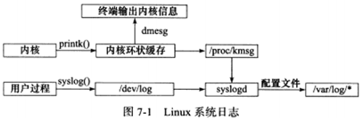
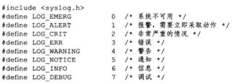
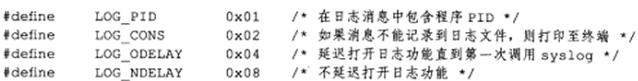
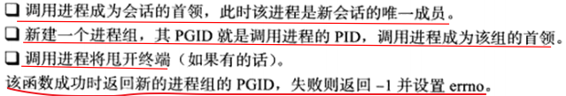
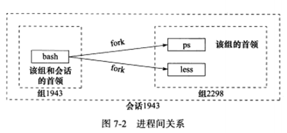
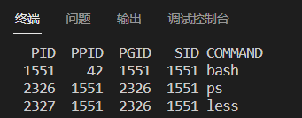
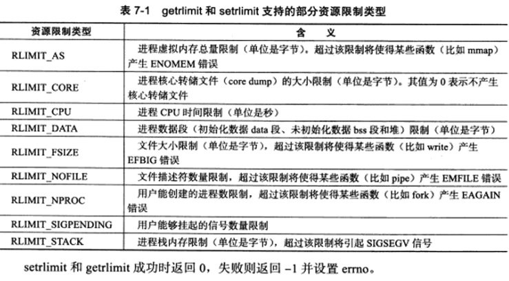

# 7.1 日志



**使用 syslogd 来作为一个守护进程来处理系统日志**，不过现在的 Linux 系统上使用的是他的升级版--**rsyslogd**。

* rsyslogd 守护进程既能接收用户进程输出的日志，又能接收内核日志。
* 用户进程是通过 syslog 函数生成系统日志。

```c++
#include <syslog.h>
// priority 参数是设施值与日志级别的按位或，设施值的默认值是 LOG_USER。
// 第二和第三个参数使用结构化进行输出。
void syslog(int priority, const char* message, ...);
```



<center>系统日志级别</center>

```c++
#include <syslog.h>
/* 
通过以下函数可以改变 syslog 的默认输出方式：
	ident 参数指定的字符串被添加到日志消息的日期和时间之后。此参数通常被设置为程序的名字。
	logopt 参数对后续 syslog 调用的行为进行配置。可参考下表。
	facility 参数可用来修改 syslog 函数中的默认设施值。
*/
void openlog(const char* ident, int logopt, int facility);

// maskpri 参数指定日志掩码值。该函数始终会执行成功，它返回调用进程先前的日志掩码值。
int setlogmask(int maskpri);

// 关闭日志
void closelog();
```



<center>logopt参数</center>


# 7.2 用户信息

以下这组函数可以**用来获得和设置当前进程的真实用户ID（UID）、有效用户ID（EUID）、真实组ID（GID）和有效组（EGID）。**

<font color=blue>注：一个进程拥有两个用户 ID：UID 和 EUID。EUID存在的目的是为了方便资源访问：使得允许程序的用户拥有该程序的有效用户权限。</font>

```c++
#include＜sys/types.h＞
#include＜unistd.h＞
uid_t getuid();				/*获取真实用户ID*/,
uid_t geteuid();			/*获取有效用户ID*/
gid_t getgid();				/*获取真实组ID*/
gid_t getegid();			/*获取有效组ID*/
int setuid(uid_t uid);		/*设置真实用户ID*/
int seteuid(uid_t uid);		/*设置有效用户ID*/
int setgid(gid_t gid);		/*设置真实组ID*/
int setegid(gid_t gid);		/*设置有效组ID*/
```


# 7.3 进程间关系

## 7.3.1 进程组

**每个进程都有一个首领进程，其 PGID 和 PID 相同。进程组将一直存在，直到其中所有进程都退出，或者加入到其他进程组。**

```c++
#include <unistd.h>
/* 该函数成功时返回进程 pid 所属进程组的 PGID，失败则返回 -1 并设置 errno。 */
pid_t getpgid(pid_t pid);
/* 该函数将 PID 为 pid 的进程的 PGID 设置为 pgid。 */
int setpgid(pit_t pid, pid_t pgid);
```


## 7.3.2 会话

```c++
#include <unistd.h>
/* 该函数不能由进程组的首领进程调用，否则将产生一个错误。对于非进程组的首领进程，调用该函数不能能创建新会话，而且还有下列效果： */
pid_t setsid(void);

/* 读取会话收敛所在的进程组的 PGID */
pid_t getsid(pid_t pid);
```




## 7.3.3 用 ps 命令查看进程关系



```bash
# 在终端输入以下命令：
ps -o pid,ppid,sid,comm | less
```



由上图可以看出：

* 1）bash 的 PID、PGID 和 SID 都相同，说明 bash 是会话的首映，也是组 1551 的首领。
* 2）ps 命令则是组 2326 的首领，因为其 PID 也是 2326。
* 3）less 命令的父进程是 bash 命令。


# 7.4 系统资源限制

```c++
#include <sys/resource.h>
/* 使用以下函数来进行资源的读取和设置 */
int getrlimit(int resource,struct rlimit*rlim);
int setrlimit(int resource,const struct rlimit*rlim);

struct rlimit
{
	rlim_t rlim_cur; 	// 资源的软限制
    rlim_t rlim_max;	// 资源的硬限制
};
```




# 7.5 改变工作目录和根目录

```c++
#include <unistd.h>
// 获取当前目录：buf用来当前目录的绝对路径名，其大小由 size 指定。
// 若当前工作目录的绝对路径长度（再加上一个空结束字符"\0"）超过 size，那么函数 getcwd 将返回 NULL。
// 若 buf 为 NULL 并且 size 非 0，那么 getcwd 可能在内部使用 malloc 动态分配内存，并将进程的当前工作目录存储在其中。并且这种情况，需要自己手动来使用 getcwd 在内部创建的这块内存。
char* getcwd(char* buf, size_t size);
// 改变进程工作目录：使用 path 参数指定要切换到的目标目录，成功返回 0，失败则返回 -1 并设置 errno。
int chdir(const char* path);

/* 该函数用来改变根目录：path参数指定要切换到的目标跟目录，成功返回 0，失败返回 -1 并设置 errno。 */
int chroot(const char* path);
```


# 7.6 服务器程序后台化

```c++
#include <unistd.h>
/* nochdir 参数用于指定是否改变工作目录，若传递参数为 0，则工作目录将被设置为'/'（根目录），否则继续使用当前工作目录 */
/* noclose 参数为 0 时，标准输入、标准输出和标准错误输出都被重定向到 /dev/null 文件，否则依然继续使用原来的设备。 */
// 该函数成功时返回 0，失败则返回 -1 并设置 errno。
int daemon(int nochdir,int noclose);
```

