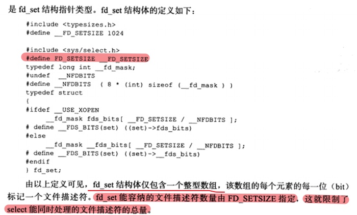
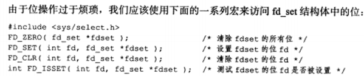
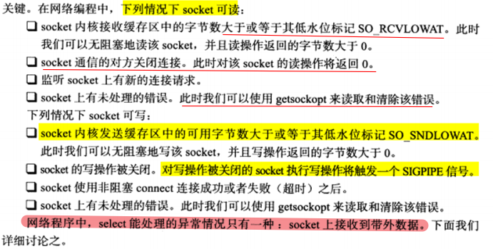
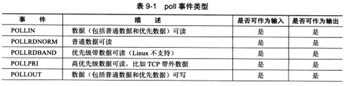
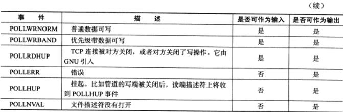
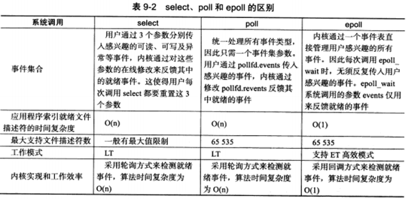

IO 复用使得程序能同时监听多个文件描述符。通常，网络程序在以下几个情况中需要使用 IO 复用技术：

* 1）客户端程序要同时处理多个 socket。
* 2）客户端程序要同时处理用户输入和网络连接。
* 3）TCP 服务器要同时处理监听 socket 和连接 socket。
* 4）服务器要同时处理 TCP 请求和 UDP 请求。
* 5）服务器要同时监听多个端口，或者处理多种服务。

**虽然 IO 复用能同时监听多个文件描述符，但是它本身是阻塞的。**并且当多个文件描述符同时就绪时，如果不采用额外的措施，程序就只能按顺序依次处理其中的每一个文件描述符，这使得服务器程序看起来像是串行工作的。如果要实现并发，只能使用多进程或者多线程等编程手段。

# 9.1 select 系统调用

select 系统调用的用途是：在一段指定时间内，监听用户感兴趣的文件描述符上的可读、可写和异常事件。

## 9.1.1 select API

```c++
#include <sys/select.h>
/* nfds 参数用来指定被监听到的文件描述符的总数，通常被设置为 select 监听的所有文件描述符中的最大值加1，因为文件描述符是从 0 开始计数的。
readfds、writefds、exceptfds 参数分别指定可读、可写和异常等事件对应的文件描述符集合。应用程序调用 select 函数时，通过这 3 哥参数传入自己感兴趣的文件描述符。select 调用返回时，内核将修改它们来通知应用程序哪些文件描述符已经准备就绪。
timeout 参数用来设置 select 函数的超时时间。是一个 timeval 结构类型的指针，采用指针的目的是内核将修改它来告诉应用程序 select 等待了多久。但是这个时间不是准的，因为调用失败后的 timeout 值是不确定的。*/
/* select 成功时返回就绪（可读、可写和异常）文件描述符的总数。如果在超时时间内没有任何文件描述符就绪，select 将返回 0，失败就返回 -1 并设置 errno。如果在 select 等待期间，程序收到信号，则 select 立即返回 -1，并设置 errno 为 EINTR。*/
int select(int ndfs, fd_set* readfds, fd_set* writefds, fd_set* exceptfds, struct timeval* timeout);

struct timeval
{
	long tv_sec;	// 秒数
    long tv_usec;	// 微秒数
};
```






## 9.1.2 文件描述符就绪条件




## 9.1.3 处理带外数据

**socket 接收普通数据，它处于可读状态；socket 接收带外数据，它处于异常状态。**


# 9.2 poll 系统调用

poll 系统调用和 select 类似，也是**在指定时间内轮询一定数量的文件描述符，以测试其中是否有就绪者。**

<font color=blue>通常情况下，应用程序需要根据 recv 调用的返回值来区分 socket 上接收到的是有效数据还是对方关闭连接的请求，并做出相应的处理。</font>

```c++
#include <poll.h>

/* fds 用来指定文件描述符上发生的可读、可写、异常等事件；nfds 参数用来指定被监听事件集合 fds 的大小；timeout 参数指定 poll 的超时，单位是毫秒。当 timeout=-1 时，poll 掉将永远被阻塞，直到某个事件发生；当 timeout 为 0 时，poll 调用将立即返回。 */

/* poll 成功时返回就绪（可读、可写和异常）文件描述符的总数。如果在超时时间内没有任何文件描述符就绪，poll 将返回 0，失败就返回 -1 并设置 errno。如果在 poll 等待期间，程序收到信号，则 poll 立即返回 -1，并设置 errno 为 EINTR。*/
int poll(struct pollfd* fds, nfds_t nfds, int timeout);

/* fd 成员用来指定文件描述符；events 成员用来告诉 poll 监听 fd 上的哪些事件，由一系列事件按位进行或；revents 成员由内核修改，用来通知应用程序 fd 上实际发生了的事件数。 */
struct pollfd
{
	int fd;			// 文件描述符
    short events;	// 注册的事件
    short revents;	// 事件发生的事件，由内核填充
};
```

poll 支持的事件类型如下：






# 9.3 epool 系统系统调用

## 9.3.1 内核时间表

```c++
#include <sys/epoll.h>
int epoll_create(int size);
int epoll_ctl(int epfd,int op,int fd, struct epoll_event* event);
```


## 9.3.2 epoll_wait 函数

```c++
#include <sys/epoll.h>
int epoll_wait(int epfd,struct epoll_event* events, int maxevents, int timeout);
```


## 9.3.3 LT 和 ET 模式


## 9.3.4 EPOLLONESHOT 事件


# 9.4 三组 IO 复用函数的比较



